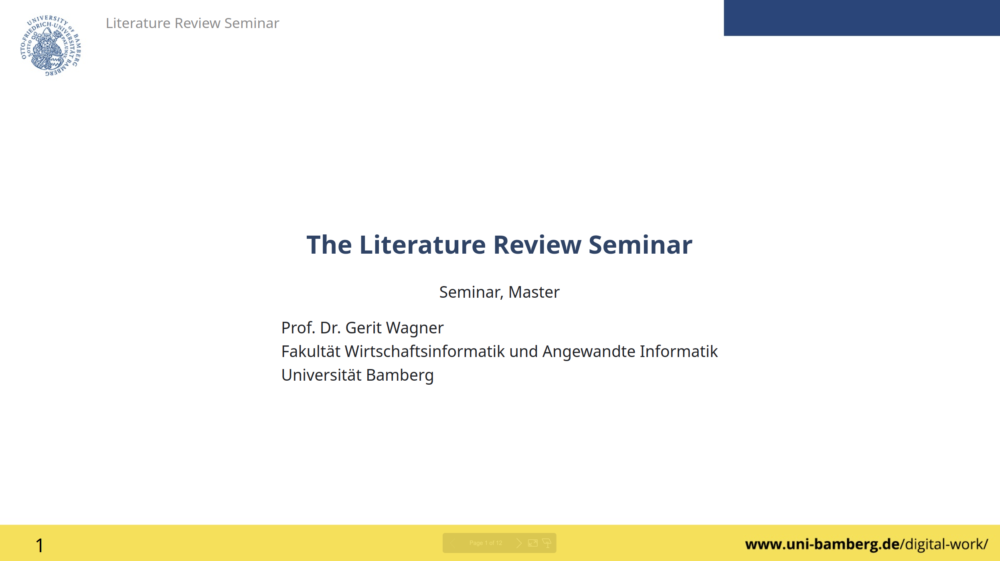
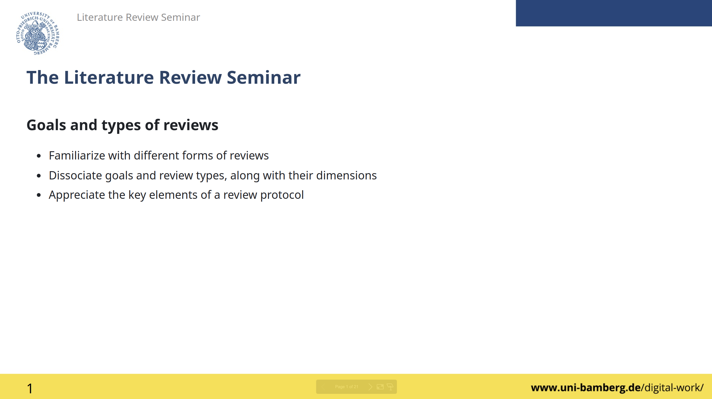
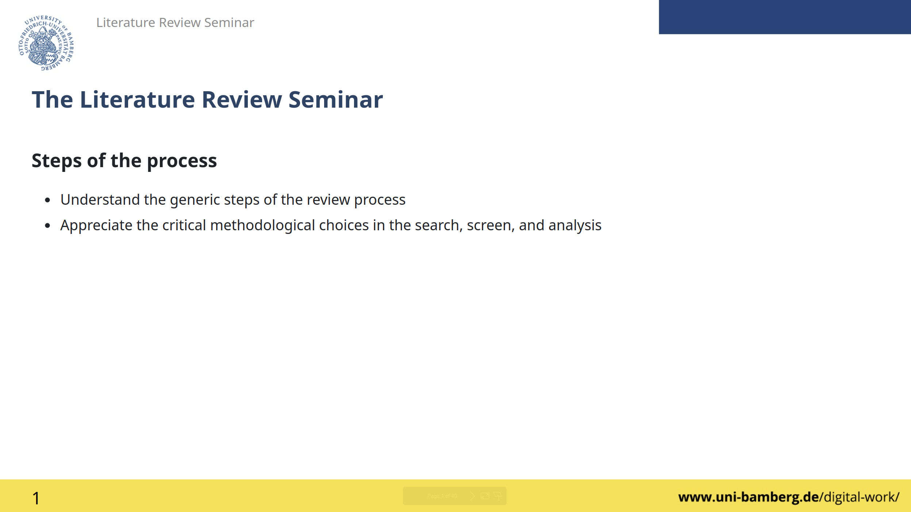

# Day 1: Goals and steps

## Introduction

  
  
<a href="../output/00-orga.html" target="_blank">Click the image to access the slides</a>

## Goals

  
  
<a href="../output/01-goals.html" target="_blank">Click the image to access the slides</a>

**Key references**

    
Rowe, F. (2014). What literature review is not: diversity, boundaries and recommendations. <em>European Journal of Information Systems</em>, 23(3), 241-255. doi:<a href="https://link.springer.com/article/10.1057/ejis.2014.7" target="_blank">10.1057/ejis.2014.7</a>

    
Paré, G., Trudel, M. C., Jaana, M., & Kitsiou, S. (2015). Synthesizing information systems knowledge: A typology of literature reviews. <em>Information & Management</em>, 52(2), 183-199. doi:<a href="https://www.sciencedirect.com/science/article/pii/S0378720614001116" target="_blank">10.1016/j.im.2014.08.008</a>

    
Schryen, G., Wagner, G., Benlian, A., and Paré, G. 2020. “A Knowledge Development Perspective on Literature Reviews: Validation of a New Typology in the IS Field,” <em>Communications of the Association for Information Systems</em>, 46 (Paper 7), 134–186. doi:<a href="https://aisel.aisnet.org/cais/vol46/iss1/7/" target="_blank">10.17705/1CAIS.04607</a>

## Steps

  
  
<a href="../output/02-steps.html" target="_blank">Click the image to access the slides</a>

**Key references**

    
Okoli, C. (2015). A guide to conducting a standalone systematic literature review. <em>Communications of the Association for Information Systems</em>, 37. doi:<a href="https://aisel.aisnet.org/cais/vol37/iss1/43/" target="_blank">10.17705/1CAIS.03743</a>

    
Boell, S. K., & Cecez-Kecmanovic, D. (2014). A hermeneutic approach for conducting literature reviews and literature searches. <em>Communications of the Association for information Systems</em>, 34, 12. doi:<a href="https://aisel.aisnet.org/cais/vol34/iss1/12/" target="_blank">10.17705/1CAIS.03412</a>

    
Paré, G., Wagner, G., & Prester, J. (2023). How to develop and frame impactful review articles: key recommendations. <em>Journal of Decision Systems</em>, 1-17. doi:<a href="https://www.tandfonline.com/doi/full/10.1080/12460125.2023.2197701" target="_blank">10.1080/12460125.2023.2197701</a>

    
Templier, M., & Pare, G. (2018). Transparency in literature reviews: an assessment of reporting practices across review types and genres in top IS journals. <em>European Journal of Information Systems</em>, 27(5), 503-550. doi:<a href="https://www.tandfonline.com/doi/full/10.1080/0960085X.2017.1398880" target="_blank">10.1080/0960085X.2017.1398880</a>

