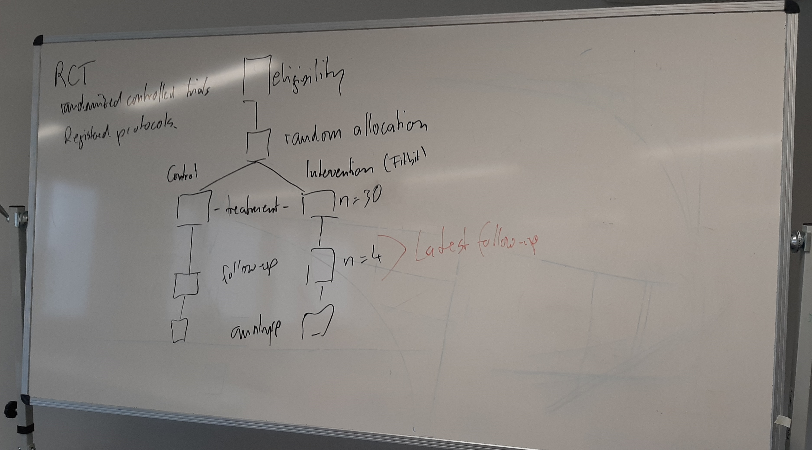

# Session 1: Steps (teaching notes)

Ask students to adopt the perspective of a reviewer and scrutinize methodological choices

## Steps

{: .highlight }
> **Warm-up**
> Ask students to draft the steps of a literature review (how they would approach it).
> Few students: whiteboard, More students: on paper and circulate it afterwards (reflect).
> Possible observations: iterations, generic vs. detailed steps, missing steps (such as reading, citation searches)

Discuss how the models fit together / what the underlying differences are

- Reading activities: in the "data extraction"
hermeneutic vs. systematic traditions
inductive/emergent vs. deductive form of data analysis

Okoli: screen before search? (search: "reporting the search")

### Generic steps: Templier and Paré (2018)

- Discuss the differences between review types (e.g., highlight the role of quality appraisal or grey literature)
- Remember: coherence!

## Problem formulation

{: .highlight }
> Discuss positioning of students' work with regard to related review papers.

- Methodological coherence objectives/type/methods
- We have done that in the first session

Examples:

- **Gap spotting**: applying and testing transaction cost economics in different empirical contexts (different organizations/geographies)
- **Problematization**: transformational leadership theory is often glorified with a focus on the positive outcomes. A problematization approach may consider unintended outcomes (e.g., promoting groupthink or suppressing dissenting opinions within an organization)

## Search

{: .info }
> Exercise: Review a search strategy

- Hits per sub-query is helpful
- It is implicit/unclear how the search strings are connected (probably OR)
- There is no rationale to include AI Aversion but not ML aversion.
- There is no rationale to require "ML decision" to be an exact match, but Algorithm* Aversion is not required to be an exact match
- The use of quotes and wildcards is inconsistent
- For a conference paper, the authors could be required to complete the building-block matrix (or justify the design of the search strategy)

Metrics:
- True positives (TP) = *retrieved* by the search and *relevant*
- False positives (FP) = *retrieved* by the search but *irrelevant*
- False negatives (FN) = *not retrieved* by the search and *relevant* ❓
- True negatives (TN) = *not retrieved* by the search but *irrelevant* ❓

- Check the Ringeval search. Surprising: the search strategy was stated without any trial-and-error/iterations. Explain the linked-list format, explain the Concept-Synonym-group approach

- It is instructive to know these metrics
- The key objective is to identify all relevant papers, but also to do that efficiently
- A certain level of noise (precision) must be accepted

SYNERGY datasets:  https://github.com/asreview/synergy-dataset

- included = relevant
- all records (retrieved) = True positives and False positives
- on average: 4% or 2% when removing outliers

- check absolute numbers: covering 1,000 papers to identify 20-40 relevant ones (search may be too narrow when the inclusion percentage is bigger)

Outlook: "We have waited too often that database provides improve search capabilities"! 

## Screening (reliability)

Illustrate "Percentage agreement, Agreement by chance" with an example on the blackboard

## Inductive

{: .info }
> **Exercise**
> 
> Worksheet is linked on the slides.
> Have students analyze, code in groups

Q: What are the key processes across extracted documents?

Key challenges:
- Terminology
- Scope
- Abstraction
- Differences in focus/perspective

## Data extraction

VOS-Viewer:
- TBD: Illustrate differences between co-citation analysis and bibliographic coupling?
- Highlight the Web of Science data export format

Vote counting: Example: Lacity et al. (2011)

TODO : summarize vote counting and give an outlook on meta-analyses

- data extraction (reliability, ...)
- risk-of-bias (quality) assessment
- Vote counting example (meta-analysis)

Aggregating evidence: Hierarchy of evidence (medicine)

{: .info }
> **Exercise**
> 
> Coding: Meta-analysis

Explain RCTs (based on CONSORT): eligibility, randomization, intervention, follow-up, analysis

Show the coding sheet: Thorndike (annotations)

- Van Blarigan:
    - intervention: booklet + Fitbit + texts
    - control: more active at baseline! (differences in baseline should be randomly distributed across studies, they should be smaller for larger samples)

- For "training": show RCT schema:

- Highlight the need to have a clear plan (e.g., which follow-up will be considered?)

Solution (LRTracker - data extraction fig 4)

