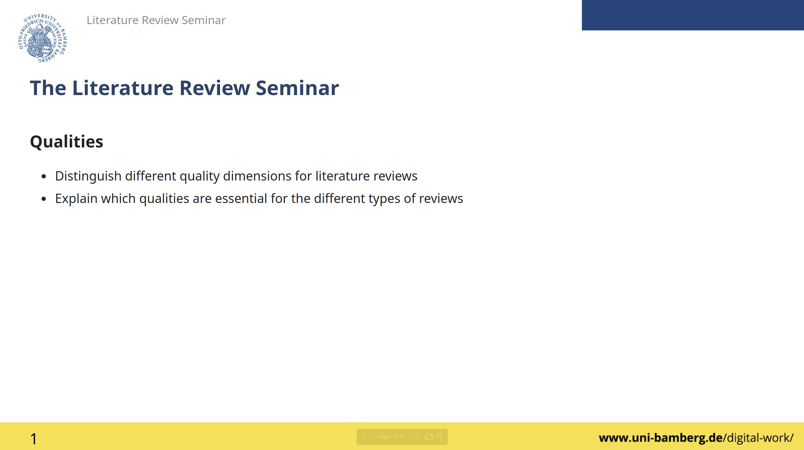
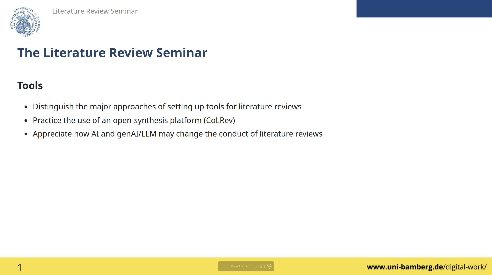

# Day 2: Qualities and tools

## Qualities

  
  
<a href="../output/03-qualities.html" target="_blank">Click the image to access the slides</a>

**Key references**

    
Paré, G., Tate, M., Johnstone, D., & Kitsiou, S. (2016). Contextualizing the twin concepts of systematicity and transparency in information systems literature reviews. <em>European Journal of Information Systems</em>, 25, 493-508. doi:<a href="https://link.springer.com/article/10.1057/s41303-016-0020-3" target="_blank">10.1057/s41303-016-0020-3</a>

    
Wagner, G., Prester, J., Roche, M. P., Schryen, G., Benlian, A., Paré, G., and Templier, M. (2021). "Which Factors Affect the Scientific Impact of Review Papers in IS Research? A Scientometric Study". <em>Information & Management</em>, 58(3), 103427. doi:<a href="https://www.sciencedirect.com/science/article/abs/pii/S037872062100001X" target="_blank">10.1016/j.im.2021.103427</a>

## Tools

  
  
<a href="../output/04-tools.html" target="_blank">Click the image to access the slides</a>

**Key references**

    
Wagner, G., Lukyanenko, R., & Paré, G. (2022). Artificial intelligence and the conduct of literature reviews. <em>Journal of Information Technology</em>, 37(2), 209-226. doi:<a href="https://journals.sagepub.com/doi/full/10.1177/02683962211048201" target="_blank">10.1177/0268396221104820</a>

