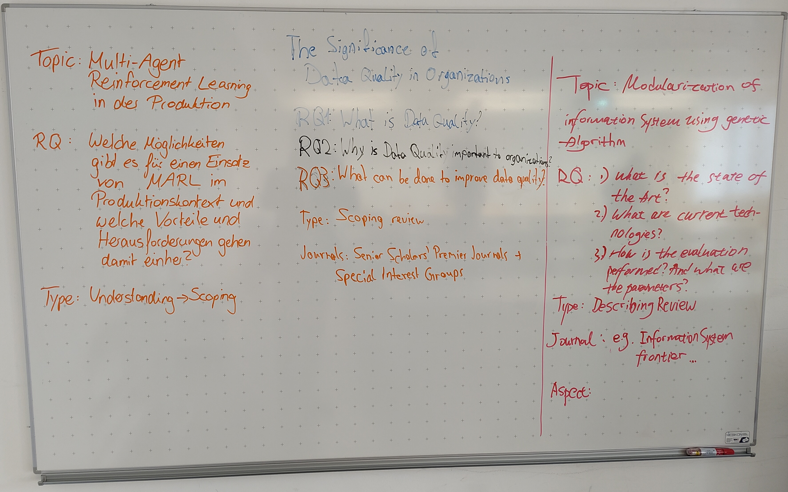

# Session 2: Qualities (teaching notes)

Reminder: submission / presentation dates

## Warm-up exercise

- With 3 participants, we spent 45 minutes on the warm-up part.
- Ask students to write their topic/RQ/review type on the whiteboard to make the discussion easier
- Discuss whether the scope is adequate, whether the fit between the research question/type of review/topic is appropriate, whether anything needs to be pilot-tested.

## Review-panel assessment of reviews

Give students cases that match their review types.

Scoping reviews:

- Beaudry2006 (overarching synthesis missing, table 2: detailed/author-centric -> general, rationale for excluding empirical papers?)
- Zhao2014a (synthesis: three focus areas is clear, methods are transparent, there is an overarching and instructive synthesis, good fit with the scoping review, broad search, the topic is emerging)

Systematic reviews:

- Jeyaraj2006
- Johnson2002

- Ask students for their initial reaction (which one is more compelling?)
- Ask for details afterwards

## Qualities

Ask students what affects quality/citations.

Given that transparency is significant, why do some reviews not report their methods explicitly? For example, Alavi and Leidner (2001). Try to take their position and argue why a methods section would not be helpful for their work.

### Reporting standards

Discuss: which aspects of systematicity/transparency are important for your review, which ones will you skip?

### Theoretical contributions

- Study specific exemplars

### Research agenda

Application: read exemplars of research agendas, discuss the key elements, how you research agenda could be developed

The impact of a research agenda: Foresight (research agenda) -> Scientific impact

### Summary

Note: theoretical or empirical contribution: not based on the evidence.

- We can assume that highly transparent papers that lack a contribution will not be cited.

{: .highligh }
> **TODO**
> 
> - Add theoretical review examples (in the review-panel assessment)
> - Add for theoretical contributions: Rivard 2024 JSIS. Ideally, link to an overview of IS review papers (filtered for impact). Mention scholarship.
