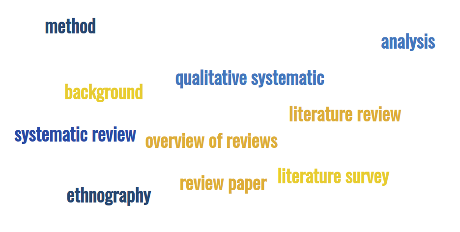
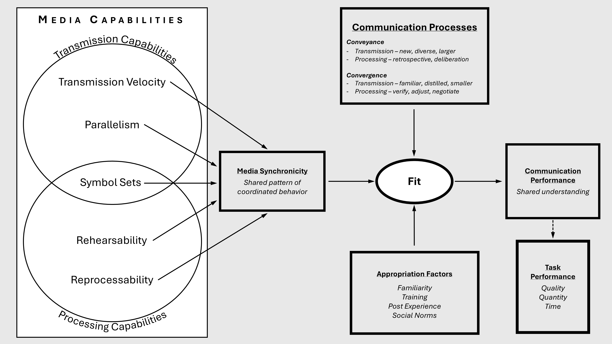
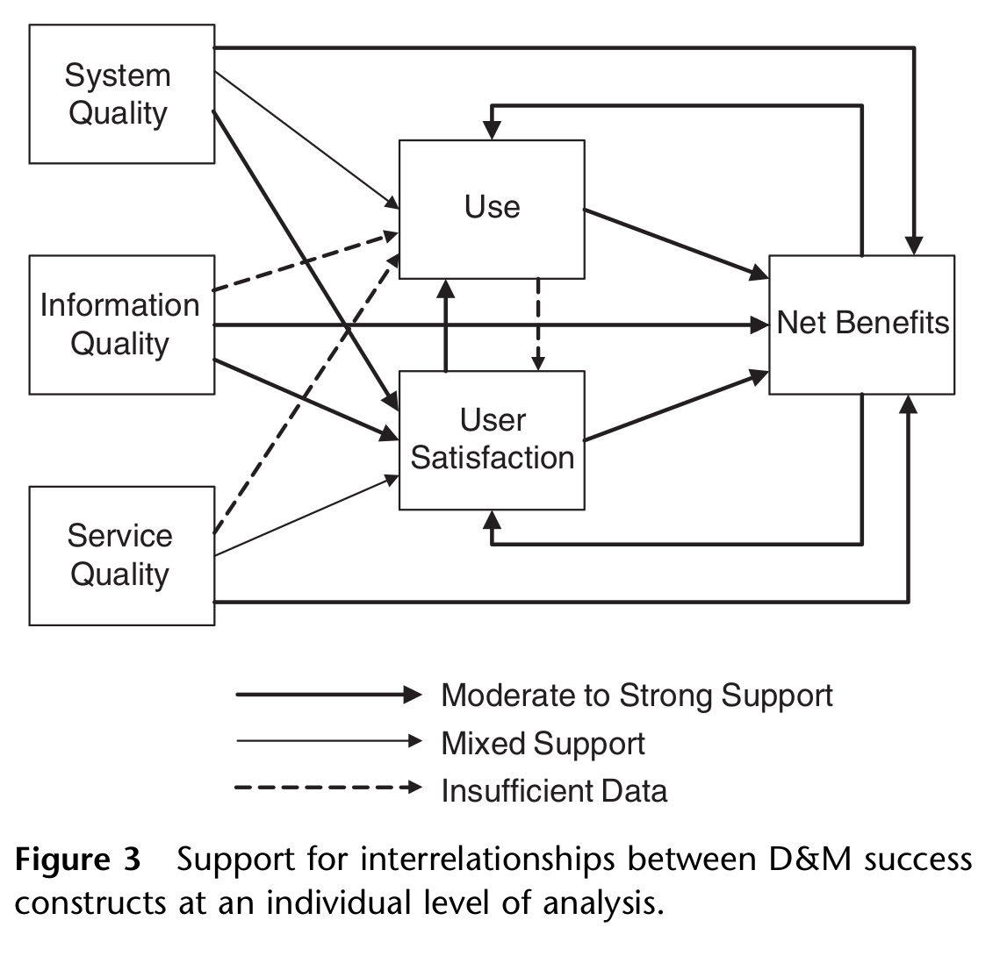
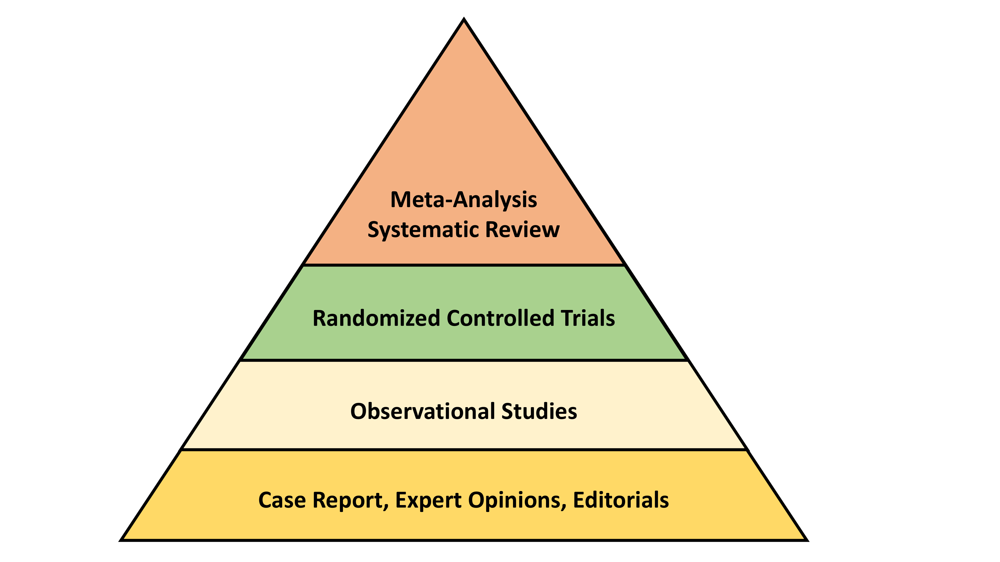
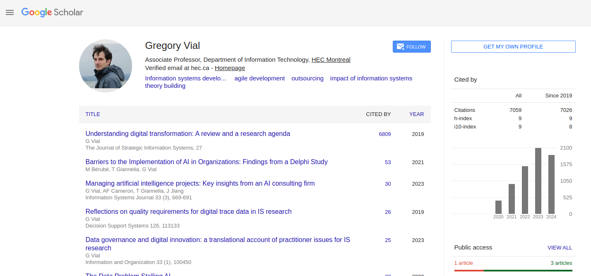

<!-- _class: centered -->

# The Literature Review Seminar

Seminar: Master | Ph.D.

Prof. Dr. Gerit Wagner
Information Systems and Applied Computer Sciences
Otto-Friedrich-Universität Bamberg

---

# Prior knowledge of literature reviews, topics, and expectations

- What is your topic and research question for this seminar?
- What are your expectations for the seminar?
- Did you work on a literature review before?

---

# Your instructor: Prof. Dr. Gerit Wagner

Sustained **fascination** for literature reviews for 10+ years:

- 2014-2018: **Dissertation** on the scientific impact of literature reviews
- 2020-2022: Postdoctoral fellowship at HEC Montréal (Canada):

    - Worked with **Guy Paré**, Ph.D., a frequent co-author and mentor, who served as a Senior Editor for Literature Reviews at JAIS
    - Served as a TA for the **literature review seminar** for Ph.D. students at five universities in Montréal
 
- 2022-2024: Professor of Information Systems at Otto-Friedrich-Universität Bamberg

    - Started offering the **Literature Review Seminar**

- I have **published 20 papers related to literature reviews** (out of 30)
- I am the lead developer of **CoLRev**, a Python tool for literature reviews

---

# Why literature reviews are exciting (I)

Literature reviews are essential to respond to key trends:

- The rapid growing volume and variety of research output:

  - Over 2 million new papers per year
  - Over 600 guidelines for different research methods (see EQUATOR network)

- The need to demonstrate novelty of contributions and avoid reinventing the wheel
- The need to exercise critical judgment of prior research

<!-- TODO: show "scholarly sophistication", "to the best of our knowledge, this is new..."  -->

In the future, the ability to synthesize, organize, and critically assess prior research will become even more essential.

---

# Why literature reviews are exciting (II)

<!-- Literature reviews can make a variety of original contributions, ranging from  -->

Literature reviews can make theoretical contributions that could never be accomplished in an individual study.

Example: Media Synchronicity Theory (Dennis et al. 2006)

<!--  -->

  

<!-- 
---

# Example: Review of the IS Success model (Petter et al. 2008)

-->

---

# Why literature reviews are exciting (III)

Meta-analyses and qualitative systematic reviews can be used to aggregate the empirical evidence across studies. They are at the top of the **hierarchy of evidence**. For **practitioners** and **policy makers**, meta-analyses can be an authoritative source of evidence:

 <!-- In healthcare, the hierarchy of evidence (on the right) is an integral part for *evidence-based practice*. There are similar examples in education (Hattie) -->

- The Cochrane Reviews (public health)
- The Campbell Collaboration (social policy, and criminal justice)
- Visible learning: A synthesis of over 800 meta-analyses relating to achievement (Hattie 2008)
<!-- - Time-series minimum-wage studies: a meta-analysis (Card and Krueger, 1995) 
- Job satisfaction and job performance: A meta-analysis (Iaffaldano and Muchinsky 1985)
-->

For **researchers**, meta-analyses and systematic reviews may indicate areas where empirical evidence is inconclusive.

Meta-analyses are able to address common errors that cannot be eliminated in empirical studies (e.g., measurement error or publication bias).

<!-- TODO : add the hierarchy of evidence (compare to IS where practitioners may often use practitioner journal/opinion papers) -->

---

# Why literature reviews are exciting (IV)

Literature reviews can have a profound impact (e.g., Vial 2019 is cited 2,000 times per year)

---

# Why literature reviews are exciting (V)

There are many open challenges, such as 

  - Considering differences and synergies between disciplines in the design of methods and tools,
  - Design of LR software to manage data, AI, and collaboration,
  - Coping with massive input and addressing urgent demands (e.g., [COVID reviews](https://github.com/greenelab/covid19-review))

---

# Learning objectives

Acquire a broad understanding of

- the **goals** and types of literature reviews
- the **steps** of the process
- the **qualities** of a good review paper
- the **tools** available

# Outcome

- A **review protocol** applying this understanding and a short **presentation**
- [Criteria and resources](https://digital-work-lab.github.io/literature-review-seminar/docs/protocol.html) are available online
- Dates for submission and presentation: see [outline](../index.html#seminar-paper)

---

---

# 🛠️ We work hard to improve the seminar for you

In line with our [values](https://digital-work-lab.github.io/handbook/docs/00.goals.html#values) and our [teaching concept](https://digital-work-lab.github.io/handbook/docs/30-teaching/30_processes/30.01.goals.html), we

- Run evaluations at the end of each semester and make the results publicly available ([view results](https://digital-work-lab.github.io/handbook/docs/30-teaching/30_processes/30.21.evaluations.html#evaluation-results)).
- Document how we implement your feedback and continuously improve the course ([see ongoing updates](https://github.com/digital-work-lab/open-source-project/issues?q=is%3Aissue%20Evaluation%20)).
- Invite you to contribute directly to our teaching materials by submitting an issue ♻️ or suggesting edits 🛠️.
- Actively actively contribute to the discourse on literature reviews and benefit from the feedback of peers:

  
Eckhardt, P., Ernst, K., Fleischmann, T., Geßler, A., Schnickmann, K., Thurner, L., and Wagner, G. “search-query: An Open-Source Python Library for Academic Search Queries”. (🎓 student working paper)

  
Wagner, G., Prester, J., Mousavi, R., Lukyanenko, R., and Paré, G. “Generative Artificial Intelligence and the Future of Literature Reviews and Scientific Inquiry”. (working paper)

  
Wagner, G., Prester, J., Lukyanenko, R., and Paré, G. “Data Management in Literature Reviews: Foundations, Principles, and Recommendations”. (working paper)

  
Wagner, G. 2024. “BibDedupe: An Open-Source Python Library for Bibliographic Record Deduplication”. <em>Journal of Open Source Software</em>, 9(97), 6318. <a href="https://doi.org/10.21105/joss.06318">doi:10.21105/joss.06318</a>

  
Paré, G., Wagner, G., and Prester, J. 2023. “How to develop and frame impactful review articles: Key recommendations“. <em>Journal of Decision Systems</em>, 33(4), 566–582.

  
Wagner, G., Lukyanenko, R., and Paré, G. 2022. “Artificial Intelligence and the Conduct of Literature Reviews”. <em>Journal of Information Technology (JIT)</em>, 37(2), 209–226. (🏆 <a href="https://journals.sagepub.com/page/jin/jin-prize/prize-winning">Best Paper Prize 2022</a>)

We value feedback — please let us know what works and how we can improve ♡

<!--  -->

<!-- 

# We value your feedback and suggestions

We encourage you to share your feedback and suggestions on our teaching materials. You can find the following links in the footer of each slide:

 

<a href="https://github.com/digital-work-lab/literature-review-seminar/issues/new" target="_blank"> ♻️ </a> Provide feedback by submitting an issue
<a href="https://github.com/digital-work-lab/literature-review-seminar/edit/main/slides/00-orga.md" target="_blank"> 🛠️ </a> Suggest specific changes by directly modifying the content

 

Your feedback plays a crucial role in helping us align with our core goals of **impact in research, teaching, and practice**. By contributing your suggestions, you help us further our commitment to **rigor**, **openness** and **participation**. Together, we can continuously enhance our work by contributing to **continuous learning** and collaboration across our community.

Visit this <a href="https://digital-work-lab.github.io/handbook/docs/10-lab/10_processes/10.01.goals.html" target="_blank">page</a> to learn more about our goals:  🚀 🛠️ ♻️ 🙏 🧑‍🎓️ . 
-->

---

# Administration and Materials

Contact: gerit.wagner@uni-bamberg.de

Consultation hours: via [Calendly](https://calendly.com/gerit-wagner/30min?month=2023-10)

Materials are available [online](https://digital-work-lab.github.io/literature-review-seminar/):

Slides
- Presentation slides will be made available for download.
- You are expected to take complementary notes and read the recommended literature.

Literature
- Literature and complementary materials are listed at the end of each lecture.
- Reading of complementary materials depends on your interest and ambition.

Acknowledgement:
- Guy Paré: the materials are largely based on his literature review seminar.

---

# References

Dennis, A. R., Fuller, R. M., & Valacich, J. S. (2008). Media, tasks, and communication processes: A theory of media synchronicity. *MIS Quarterly*, 32(3), 575-600. doi:[10.2307/25148857](https://www.jstor.org/stable/25148857)

Petter, S., DeLone, W., & McLean, E. (2008). Measuring information systems success: models, dimensions, measures, and interrelationships. *European Journal of Information Systems*, 17(3), 236-263. doi:[10.1057/ejis.2008.15](https://link.springer.com/article/10.1057/ejis.2008.15)

Rando, H. M., Greene, C. S., Robson, M. P., Boca, S. M., Wellhausen, N., Lordan, R., ... & COVID-19 Review Consortium. (2021). SARS-CoV-2 and COVID-19: An evolving review of diagnostics and therapeutics. Manubot. [link](https://greenelab.github.io/covid19-review/v/32afa309f69f0466a91acec5d0df3151fe4d61b5/)

Vial, G. (2019). Understanding digital transformation: A review and a research agenda. *The Journal of Strategic Information Systems*, 28(2), 118-144. doi:[10.1016/j.jsis.2019.01.003](https://www.sciencedirect.com/science/article/pii/S0963868717302196)
