# The Literature Review Seminar

## Steps of the process

- Understand the generic steps of the review process
- Appreciate the critical methodological choices in the search, screen, and analysis

---

## What are the generic steps of a literature review?

<!-- 
https://unsplash.com/de/fotos/menschen-die-tagsuber-auf-grunem-rasen-sitzen-7rImz-goqfQ
-->
---

## Generic steps: Examples

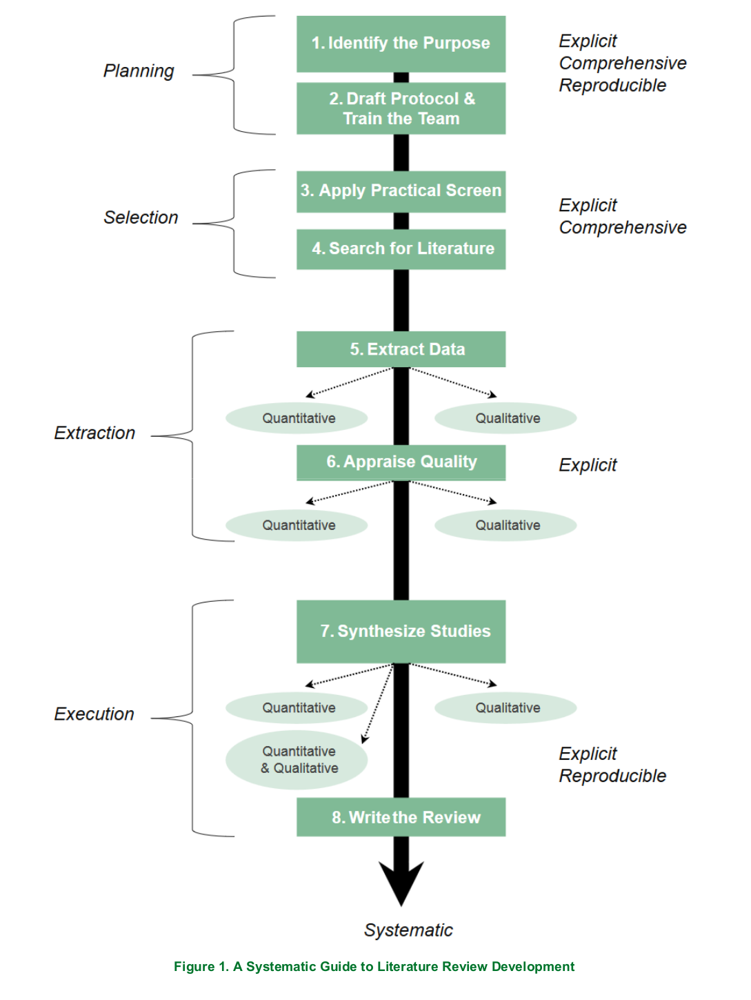

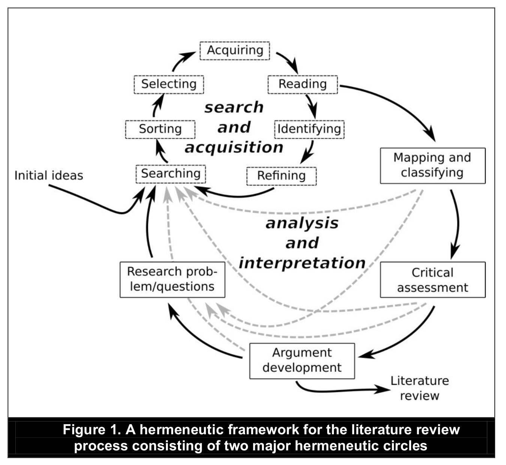

- The hermeneutic framework of Boell and Cecez-Kecmanovic (2014) vs.
- The systematic guide of Okoli (2015)

<!-- 
Discuss how the models fit together / what the underlying differences are

- Reading activities: in the "data extraction"
hermeneutic vs. systematic traditions
inductive/emergent vs. deductive form of data analysis

Okoli: screen before search? (search: "reporting the search")
-->

---

## Generic steps: Templier and Paré (2018)

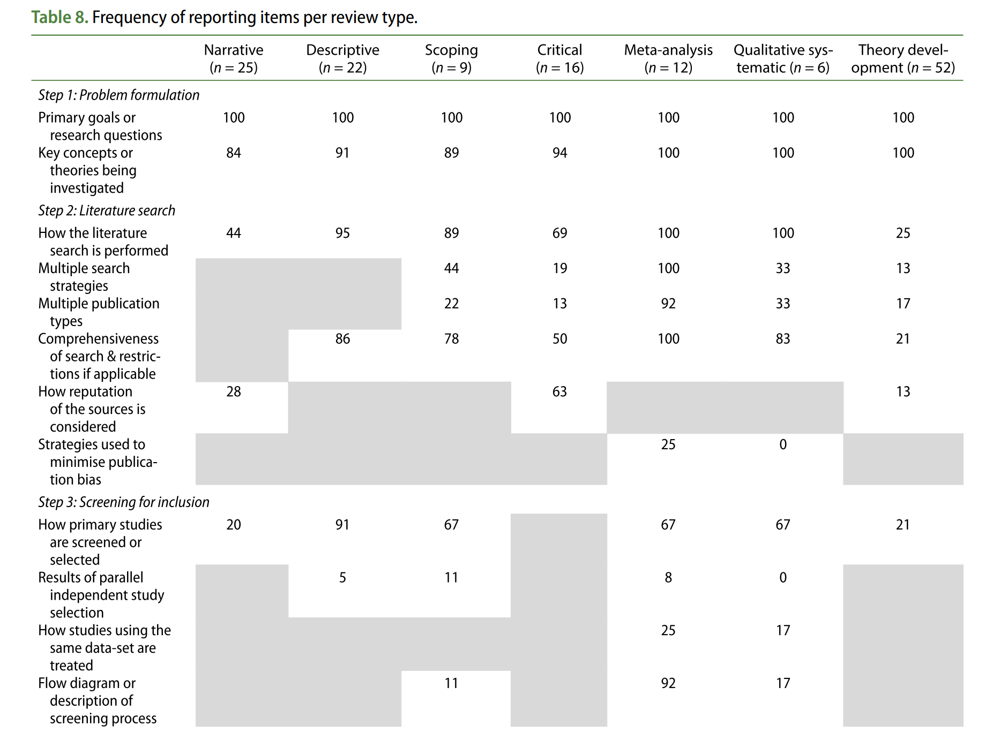

---

## Generic steps: Templier and Paré (2018)

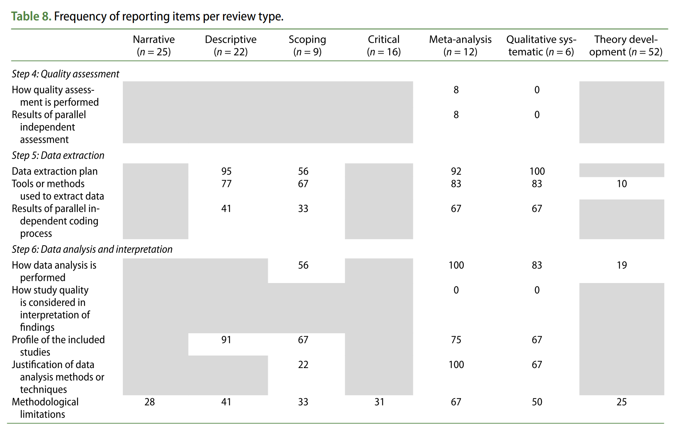

<!-- TODO : discuss the differences between review types -->

---

## Generic steps

Summary

- The **nature of steps varies**, including their labels, their characteristics, and how they are arranged
- The steps **depend on the review type**
- Some steps are more **generic**, while others are more **specific** and only apply to selected types of reviews

In the following, we focus on the steps summarized by Templier and Paré (2018):

1. Problem formulation
2. Literature search
3. Screening for inclusion
4. Quality assessment
5. Data extraction
6. Data analysis and interpretation

<!-- Remember: coherence -->

---

## Problem formulation

- Rationale for the review, including an overview of related review papers
- Gap-spotting or problematization (Alvesson and Sandberg 2011):

    - Gap-spotting is seen as (too) common, and may only signify a contribution if the authors can make a convincing argument that the gap is important
    - Problematization, as an approach that challenges existing theory and the underlying assumptions, can lead to more interesting and noteworthy contributions

- Research question or objectives

<!-- 

- methodological coherence objectives/type/methods
-> we have done that in the first session
-->

---

## Literature search: Foundations

- Search types: *Lookup* vs. *exploratory* vs. **systematic search** (Gusenbauer and Haddaway 2021)
- Search scope: time, journals, and academic vs. gray literature
- Search techniques (with associated search sources):

    - Database search (keyword-based)
    - Backward search, i.e., search reference sections to go back in time (aka. snowballing, pearl-growing)
    - Forward search, i.e., using citation indices to go forward in time
    - Table-of-content search (whole journals)
    - Sampling from prior review papers
    - Consulting with peers (e.g., through direct contact or mailing lists)

---

## Literature search: Citation searches

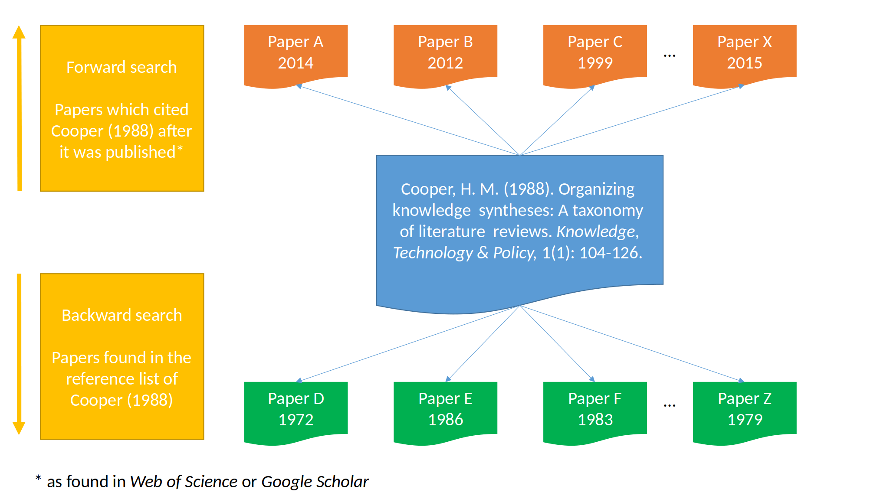

---

## Literature search: The database search

- Most common search strategy in the management disciplines (58% according to Hiebl, 2023)
- Common databases: Web of Science, EBSCO Host, ABI Informs, AIS eLibrary, ACM Digital Library, IEEEXplore, etc. (Knackstedt and Winkelmann 2006, Hiebl 2023)
- Effective search strategies for database searches combine search terms with Boolean operators

---

## Literature search: The "building-blocks" approach

- RQ: What factors do influence physicians’ acceptance of telemedicine?

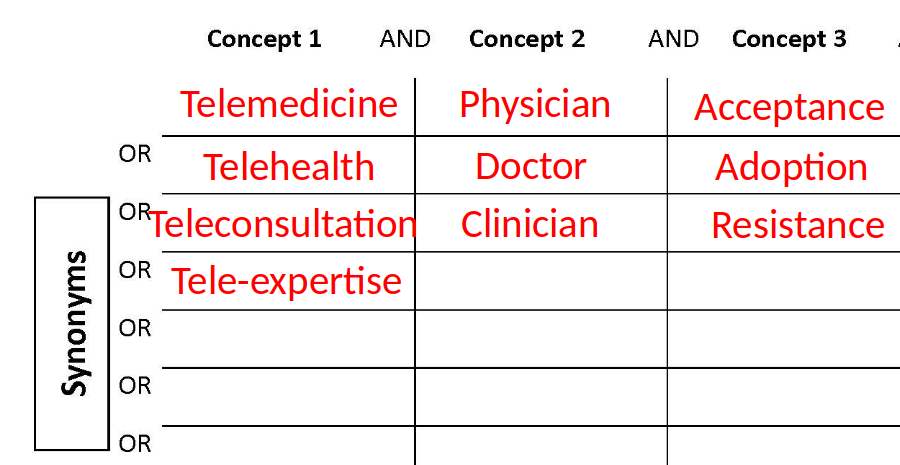

Resulting search string: `(telemedicine OR telehealth OR ...) AND (physician OR doctor OR ...) AND (adoption OR acceptance OR resistance OR ...)`

Building blocks can be based on established frameworks like PICO (population-intervention-control-outcome)

<!--

-> Check the Ringeval search. Surprising: the search strategy was stated without any trial-and-error/iterations. Explain the linked-list format, explain the Concept-Synonym-group approach
-->

---

## Exercise: Review a search strategy

Imagine you serve as a reviewer for a conference. You review a paper on algorithmic decision making, along with Table 2.

- Evaluate the proposed search strategy critically, taking into account the building-block approach. 
- Make a recommendation to accept, revise, or reject.

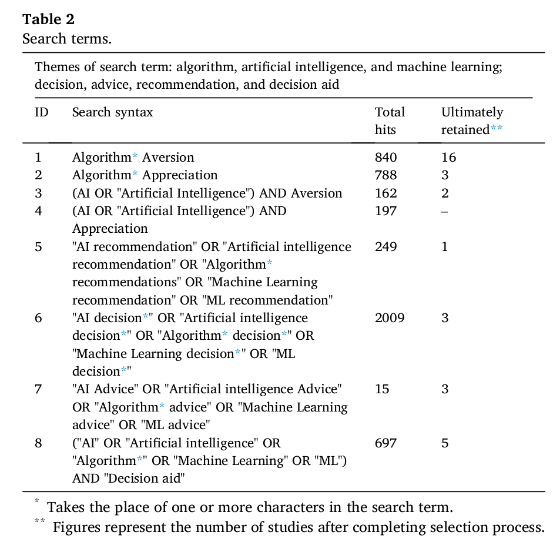

> \* Note: Example taken from Mahmud, H., Islam, A. N., Ahmed, S. I., & Smolander, K. (2022). What influences algorithmic decision-making? A systematic literature review on algorithm aversion. *Technological Forecasting and Social Change*, 175, 121390.

---

## Literature search: Strengths and shortcomings of database searches

Strengths:

- Relatively efficient (see Wagner et al. 2021, Appendix A3)
- Transparent and reproducible

Shortcomings:

- Keyword searches: rely on exact matches 
- Need to be familiar with the vocabulary (check keywords or taxonomies like [MeSH](https://meshb.nlm.nih.gov/?_gl=1*1v2wumx*_ga*MTAzMDkzMDY3OC4xNjg1OTY3ODEy*_ga_7147EPK006*MTY5ODMwNDkxNi4xMC4xLjE2OTgzMDQ5MjIuMC4wLjA.*_ga_P1FPTH9PL4*MTY5ODMwNDkxNi4xMC4xLjE2OTgzMDQ5MjIuMC4wLjA.) etc.)
- Assumption of controlled scientific vocabulary although disciplines like Information Systems have abandoned corresponding efforts decades ago (Weber 2003)

<!-- anecdote: sex vs. gender -->

---

## Literature search: Search metrics

The common objective is to identify all relevant papers. Literature searches retrieve documents:

<!-- 
- $TP$: True positives = *retrieved* by the search and *relevant*
- $FP$: False positives = *retrieved* by the search but *irrelevant*
- $FN$: False negatives = *not retrieved* by the search and *relevant* ❓
- $TN$: True negatives = *not retrieved* by the search but *irrelevant* ❓
 -->

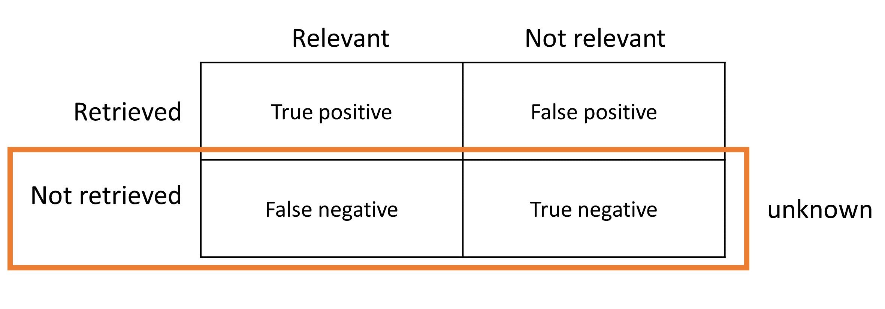

Three key metrics are particularly relevant in the context of literature searches (Cooper et al. 2018):

1. **Sensitivity** aka. recall: $TP / (TP + FN)$. *How many of the relevant papers do we find?* ❓
2. **Specificity**: $TN / (TN + FP)$. *How well does the search exclude irrelevant results?* ❓
3. **Precision**: $TP / (TP + FP)$. *How many of the search results are actually relevant?*

---

## Literature search: Assessing searches

- **Precision** is the only metric that can be measured in a typical literature review
- A **highly precise search strategy should be suspicious** because the search may not be comprehensive enough
- Based on the [SYNERGY](https://github.com/asreview/synergy-dataset) dataset, average precision is 2% - 4% in medicine, chemistry, and computer science

Would you expect more precise searches in disciplines like Information Systems, Management, or the Social Sciences? 

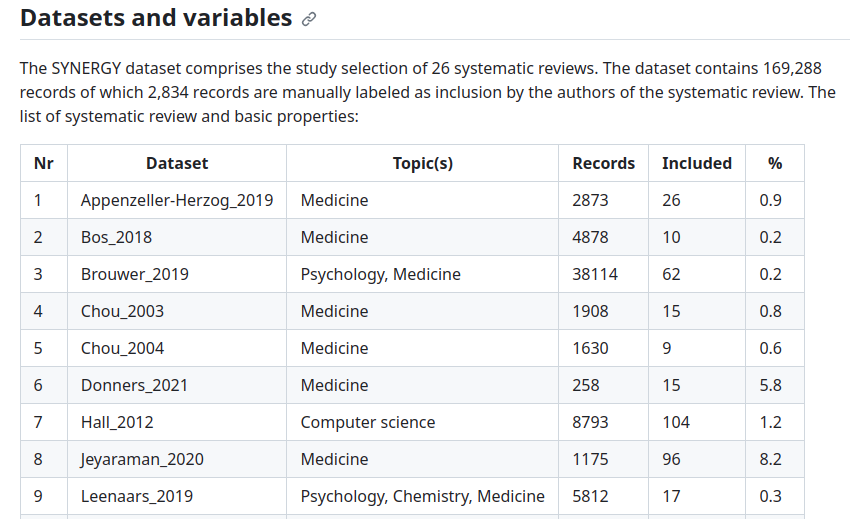

<!-- 
It is instructive to know these metrics
The key objective is to identify all relevant papers, but also to do that efficiently
A certain level of noise (precision) must be accepted
SYNERGY datasets: 
https://github.com/asreview/synergy-dataset
included = relevant
all records (retrieved) = True positives and False positives
on average: 4% or 2% when removing outliers
-> check absolute numbers: 
covering 1,000 papers to identify 20-40 relevant ones (search may be too narrow when the inclusion percentage is bigger)

-->

---

## Literature search: Application

- Draft a search strategy for your topic following the building-blocks approach.

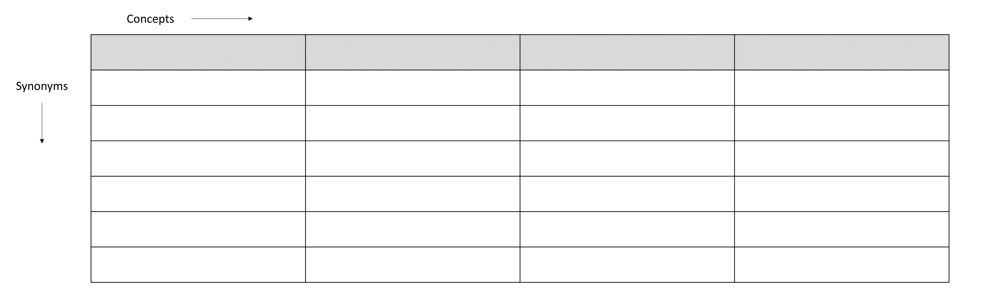

- Does the building block approach provide a good fit with your context?

---

## Literature search: Outlook

Open challenge: 

- How can we iterate efficiently?
- How do we justify the decision to terminate a search?
- How can we use evidence to search effectively?
- How can we make progress without database providers?

<!-- 
"We have waited too often that database provides improve search capabilities"! 

https://unsplash.com/de/fotos/toddlers-standing-in-front-of-beige-concrete-stair-bJhT_8nbUA0
-->

---

## Screen

- The screen is typically completed in two parts:

    - A pre-screen based on metadata (*"include if in doubt"*)
    - A screen based on full-text documents, resulting in the final sample

- The screen is often based on explicit inclusion and exclusion criteria

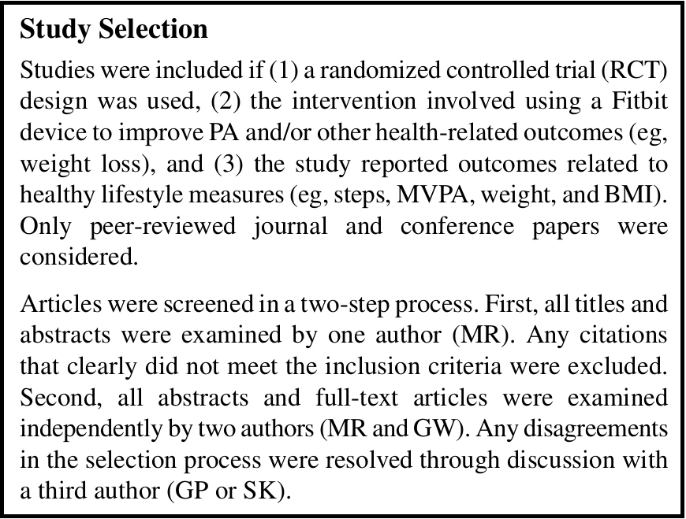

---

## Screening reliability

Screening tasks are often split among the review team to complete the process **more quickly**, and to ensure **reliable decisions**

Process:

1. Definition of criteria, training, and pilot test
2. Parallel-independent screen (partially or fully overlapping sample)
3. Independent screen of the remaining papers (if any)
4. Reconciliation: in case of disagreements, final decisions are made by selected team members (often more senior researchers)
5. Calculate inter-rater agreement (e.g., Cohen's Kappa) and report the process

<!-- 
-> illustrate "Percentage agreement, Agreement by chance" with an example on the blackboard
https://en.wikipedia.org/wiki/Cohen%27s_kappa
-->
---

TODO : bring interpretations of kappa values, mention that higher kappa is difficult when the distribution is skewed

---

## Reporting the search and screen

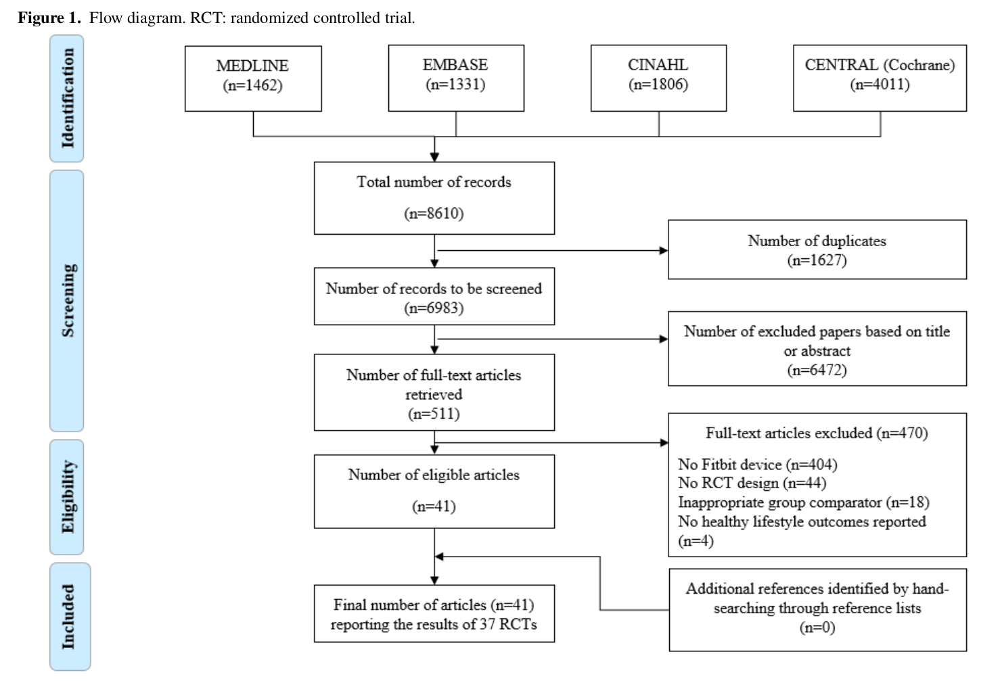

The PRISMA flow chart (updated version by Tricco et al. 2018)

An online version is available [here](https://estech.shinyapps.io/prisma_flowdiagram/)

---

<!-- _class: centered -->

# Break

<!-- https://unsplash.com/de/fotos/%EC%BB%B5%EC%97%90-%EC%BB%A4%ED%94%BC%EC%9D%98-%EC%8B%9C%EA%B0%84-%EA%B2%BD%EA%B3%BC-%EC%82%AC%EC%A7%84-5iRgh_G0eRY -->

---

## Reading strategies

The reading activities can be organized strategically at two levels:

- The overall corpus level: In which order should papers be read or skimmed?

- The individual paper level: How should the different parts of a paper be read?

Assume you have 300 papers to cover, how would you organize the reading activities?

---

## Data analysis

Key differences with regard to data extraction and analysis:

- Focus on metadata vs content 
- Inductive vs deductive reasoning

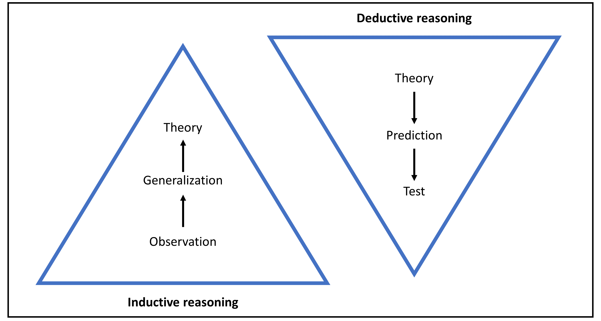

---

## Data analysis example: Metadata profiling (example)

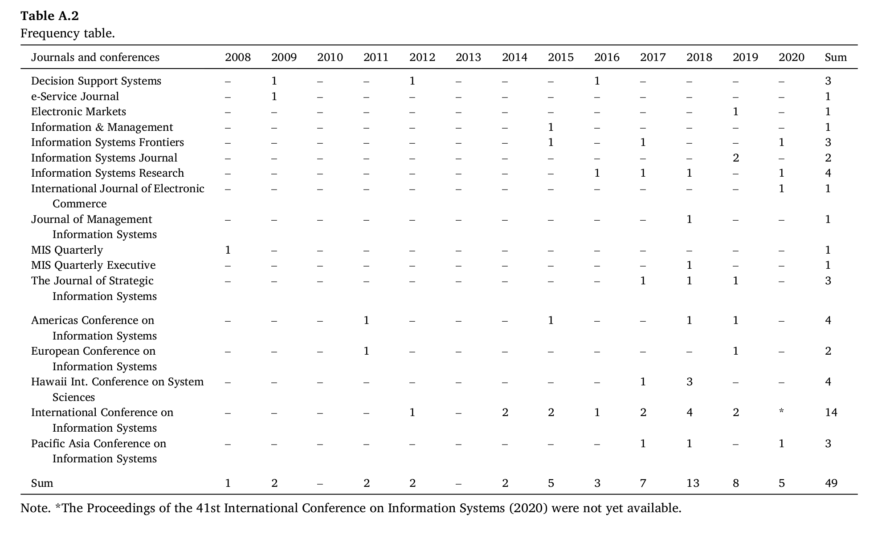

<!-- cite Bandara !? on profiling? -->

---

## Data analysis example: Co-citation analysis

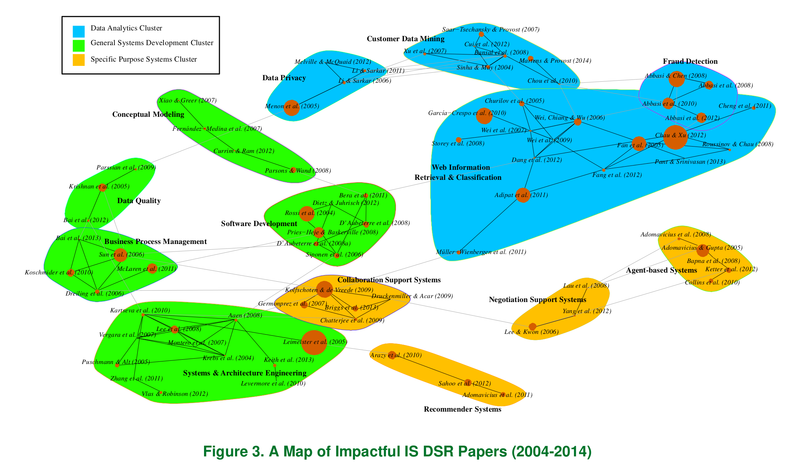

---

## Data analysis example: VOS viewer

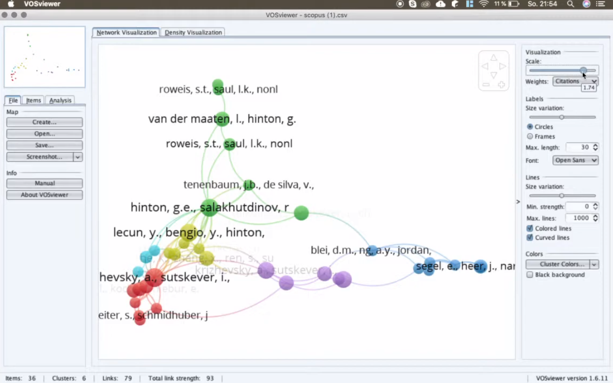

- Example keyword analysis: https://www.youtube.com/watch?v=9dTWkNRxUtw
- Example bibliometric analysis: https://www.youtube.com/watch?v=xmLWjcsV4zQ

<!--
TBD: Illustrate differences between co-citation analysis and bibliographic coupling?

Highlight the Web of Science data export format

-->

---

## Data analysis example: Inductive coding

Grounded theory is an inductive method commonly used in literature reviews (Wolfswinkel et al. 2013)

In the data analysis phase, the three coding techniques are central:

- **Open coding** generates higher-abstraction level type categories from sets of concepts/variables
- **Axial coding** develops categories and relates them to their possible sub-categories
- **Selective coding** integrates and refines the categories

---

## Data analysis: The Gioia data structure

The coding process and results are often illustrated in the *Gioia data structure*

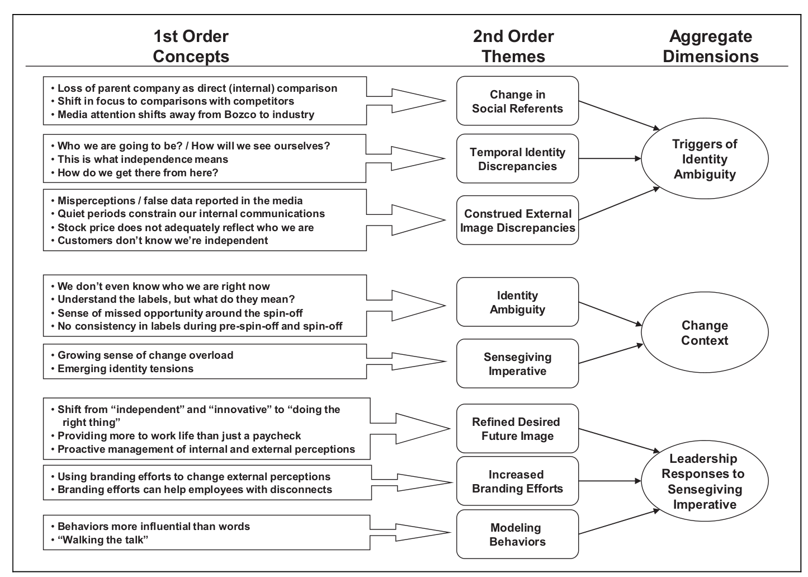

---

## Data analysis: Example for inductive analysis

- Scope: Digital platforms for knowledge-intensive services, such as Upwork, Fiverr, or TopCoder
- Sample: 50 papers, mostly published in the Information Systems discipline
- Data: Text fragments and figures have been pre-selected: [access the worksheet](../teaching_notes/Inductive-coding-Worksheet.pdf)

- Objective: Analyze extant research and inductively develop a process model

---

TODO : present a clear Gioia structure as a result

---

## Data analysis example: Aggregating evidence (I)

**Vote counting** is one technique to aggregate the evidence from prior empirical studies

- Key variables are extracted and compiled in a list of master codes
- Effects between independent and dependent variables are coded:

    - *+1* for a positive significant effect
    - *0* for no-significant effects
    - *-1* for negative significant effects

<!-- 
Exampe: Lacity et al. (2011)

TODO : summarize vote counting and give an outlook on meta-analyses

- data extraction (reliability, ...)
- risk-of-bias (quality) assessment
- Vote counting example (meta-analysis)
 -->
---

## Example: Lacity et al. (2011)

Effects are aggregated and presented as follows:

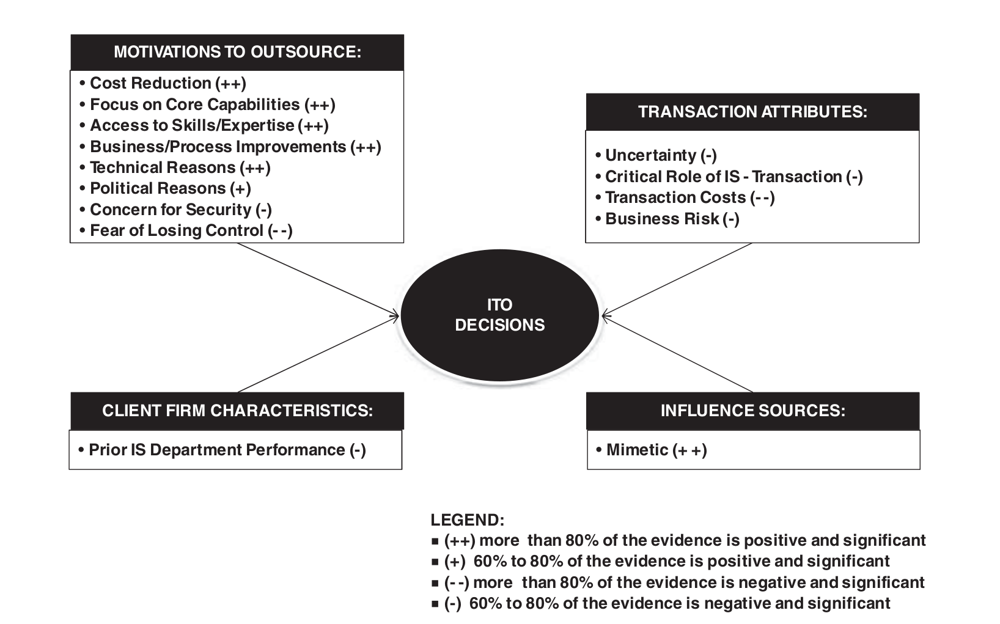

---

## Data analysis example: Aggregating evidence (II)

Strength of vote counting:

- Aggregates evidence from **quantitative and qualitative studies**

Shortcoming of vote counting:

- Risk of bias is not assessed
- Effect sizes are not determined

Meta-analysis techniques address these shortcomings.

<!-- - Hierarchy of evidence (medicine) -->

---

## Data analysis: Risk of bias assessment (I)

- Example: Ringeval et al. (2020): "Fitbit-Based Interventions for Healthy Lifestyle Outcomes: Systematic Review and Meta-Analysis"
- The [Cochrane risk-of-bias tool for randomized trials (RoB 2)](https://training.cochrane.org/handbook/current/chapter-08) covers seven **domains of bias** as illustrated in the table

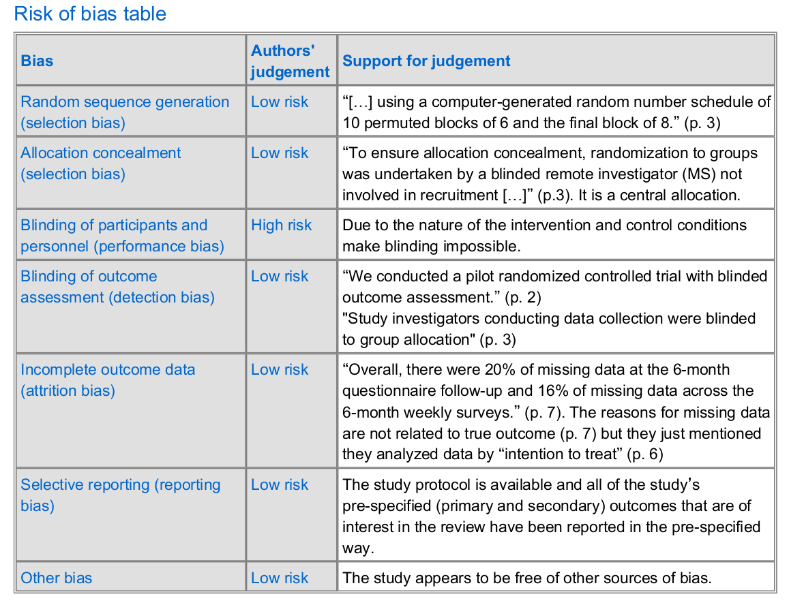

---

## Data analysis: Risk of bias assessment (II)

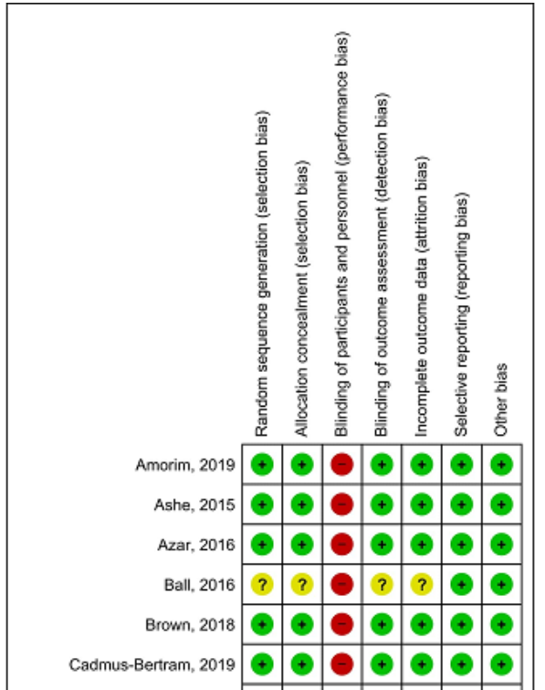

---

## Data analysis: Data extraction

Research objective: "to assess the effects of Fitbit-based interventions, compared with nonwearable control groups, on healthy lifestyle outcomes." (Ringeval et al. 2020)

Data extraction (example): 

- Two randomized controlled trials: Thorndike et al. 2014, van Blarigan et al. 2019
- Extract the following findings (at follow-up):

---

## Data analysis: Forest plot of standardized mean differences

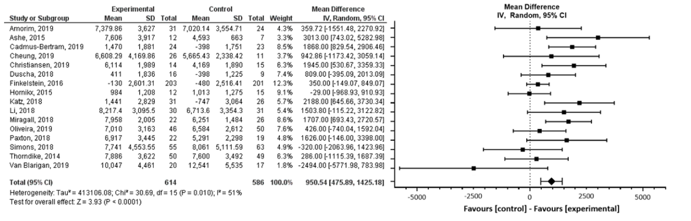

---

## Discussion of the data analysis section

Create a quick draft for the data extraction and analysis section. 

- Would you follow an inductive or deductive approach (why)?
- What outcomes would you expect ideally?

<!-- 
Topic 4A
Topic 4B
Grounded theory: Topic 11
-->

---

# We value your feedback and suggestions

We encourage you to share your feedback and suggestions on this slide deck:

<a href="https://github.com/digital-work-lab/literature-review-seminar/edit/main/02-steps.md" target="_blank">
   Suggest specific changes by directly modifying the content
</a>
 
<a href="https://github.com/digital-work-lab/literature-review-seminar/issues/new" target="_blank">
   Provide feedback by submitting an issue
</a>
 

Your feedback plays a crucial role in helping us align with our core goals of **impact in research, teaching, and practice**. By contributing your suggestions, you help us further our commitment to **rigor**, **openness** and **participation**. Together, we can continuously enhance our work by contributing to **continuous learning** and collaboration across our community.

Visit this <a href="https://digital-work-lab.github.io/handbook/docs/10-lab/10_processes/10.01.goals.html" target="_blank">page</a> to learn more about our goals:  🚀 🛠️ ♻️ 🙏 🧑‍🎓️ . 

---

## References

**Generic steps**

Okoli, C. (2015). A guide to conducting a standalone systematic literature review. *Communications of the Association for Information Systems*, 37. doi:[10.17705/1CAIS.03743](https://aisel.aisnet.org/cais/vol37/iss1/43/)

Boell, S. K., & Cecez-Kecmanovic, D. (2014). A hermeneutic approach for conducting literature reviews and literature searches. *Communications of the Association for information Systems*, 34, 12. doi:[10.17705/1CAIS.03412](https://aisel.aisnet.org/cais/vol34/iss1/12/)

Templier, M., & Pare, G. (2018). Transparency in literature reviews: an assessment of reporting practices across review types and genres in top IS journals. *European Journal of Information Systems*, 27(5), 503-550. doi:[10.1080/0960085X.2017.1398880](https://www.tandfonline.com/doi/full/10.1080/0960085X.2017.1398880)

---

**Problem formulation**

Alvesson, M., & Sandberg, J. (2011). Generating research questions through problematization. *Academy of Management Review*, 36(2), 247-271. doi:[10.5465/amr.2009.0188](https://journals.aom.org/doi/abs/10.5465/amr.2009.0188)

**Search**

Gusenbauer, M., & Haddaway, N. R. (2021). What every researcher should know about searching–clarified concepts, search advice, and an agenda to improve finding in academia. *Research Synthesis Methods*, 12(2), 136-147. doi:[10.1002/jrsm.1457](https://onlinelibrary.wiley.com/doi/full/10.1002/jrsm.1457)

Hiebl, M. R. (2023). Sample selection in systematic literature reviews of management research. *Organizational Research MNethods*, 26(2), 229-261. doi:[10.1177/109442812098685](https://journals.sagepub.com/doi/full/10.1177/1094428120986851)

Knackstedt, R., & Winkelmann, A. (2006). Online-Literaturdatenbanken im Bereich der Wirtschaftsinformatik: Bereitstellung wissenschaftlicher Literatur und Analyse von Interaktionen der Wissensteilung. *Wirtschaftsinformatik*, 1(48), 47-59. doi:[10.1007/s11576-006-0006-1](https://link.springer.com/article/10.1007/s11576-006-0006-1)

---

Wagner, G., Prester, J., & Paré, G. (2021). Exploring the boundaries and processes of digital platforms for knowledge work: A review of information systems research. *The Journal of Strategic Information Systems*, 30(4), 101694. doi:[10.1016/j.jsis.2021.101694](https://www.sciencedirect.com/science/article/pii/S096386872100041X)

**Screen**

Tricco, A. C., Lillie, E., Zarin, W., O'Brien, K. K., Colquhoun, H., Levac, D., ... & Straus, S. E. (2018). PRISMA extension for scoping reviews (PRISMA-ScR): checklist and explanation. 
*Annals of Internal Medicine*, 169(7), 467-473. doi:[10.7326/M18-0850](https://www.acpjournals.org/doi/full/10.7326/M18-0850)

---

**Data analysis**

Wolfswinkel, J. F., Furtmueller, E., & Wilderom, C. P. (2013). Using grounded theory as a method for rigorously reviewing literature. European journal of information systems, 22(1), 45-55. doi:[10.1057/ejis.2011.51](https://www.tandfonline.com/doi/full/10.1057/ejis.2011.51)

Higgins J, Savovic J, Page MJ, Elbers RG, Sterne JA. Chapter 8: Assessing risk of bias in a randomized trial. In: *Cochrane Handbook for Systematic Reviews of Interventions*. London: Cochrane; 2019. [link](https://training.cochrane.org/handbook/current/chapter-08)

Lacity, M. C., Solomon, S., Yan, A., & Willcocks, L. P. (2011). Business process outsourcing studies: a critical review and research directions. *Journal of Information Technology*, 26, 221-258. doi:[10.1057/jit.2011.25](https://link.springer.com/article/10.1057/jit.2011.25)

Ringeval, M., Wagner, G., Denford, J., Paré, G., & Kitsiou, S. (2020). Fitbit-based interventions for healthy lifestyle outcomes: systematic review and meta-analysis. *Journal of Medical Internet Research*, 22(10), e23954. doi:[10.2196/23954](https://www.jmir.org/2020/10/e23954/)