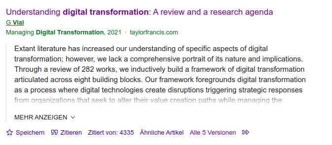
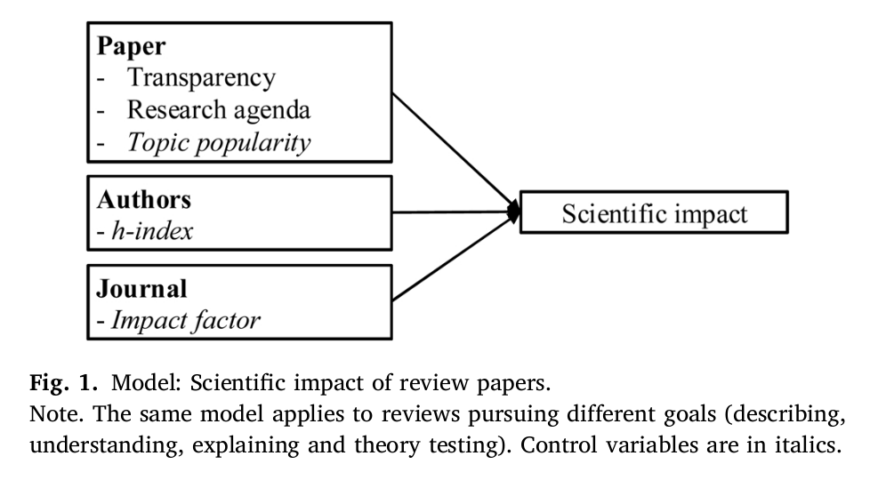
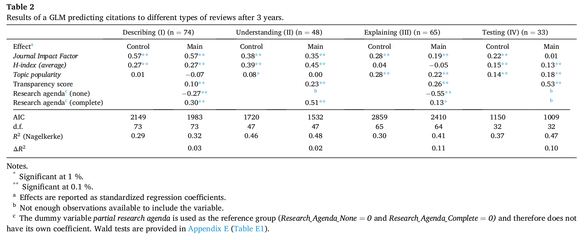
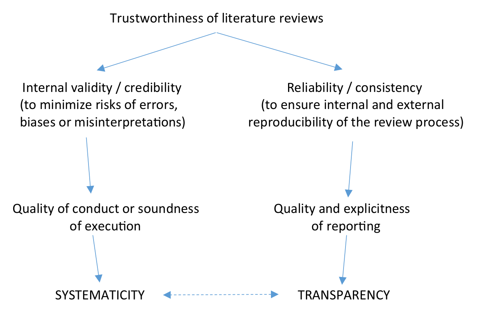
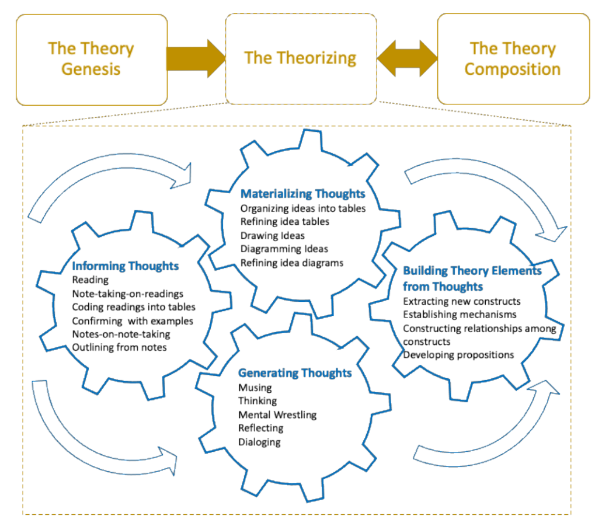
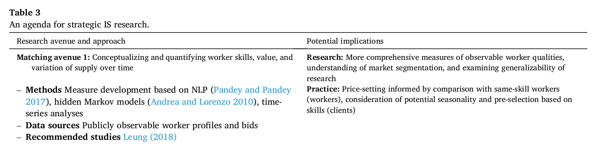

# The Literature Review Seminar

## Qualities

- Distinguish different quality dimensions for literature reviews
- Explain which qualities are essential for the different types of reviews

---

## Warm-up exercise

 **Task** (10 min): Record your topic, research question, and the type of review. If aiming for a top-tier journal, what key aspects would you focus on to produce a high-quality review paper?

---

## Studying the qualities of exemplars

Studying exemplary literature reviews and analyzing the qualities that make them compelling provides valuable insights into what constitutes a high-quality review.

 Form  a review panel to evaluate the four review papers. Provide recommendations on which papers to accept and which to reject, along with justifications for each decision.

---

## What makes a review successful?

  

---

## An empirical analysis

The study of Wagner et al. (2021)

- There is a plethora of commentaries, opinions, suggestions, and ideas on the characteristics of a high quality review 
- We brought together an international and interdisciplinary team to study the question empirically
- The research question: What are the main attributes that affect the scientific impact of IS review papers?
- The research model covers factors at three levels: the paper, the authors, and the journal

---

## Findings

---

## Key insights

- Methodological **transparency** is associated with higher scientific impact across all types of reviews
- The development of a **research agenda** is associated with higher scientific impact (except for reviews aimed at theory testing, due to a lack of data)
- The effects vary between **review types**, providing empirical evidence to the notion of methodological and typological pluralism
- Differences in **theoretical contributions** are hard to measure (contributing to *explaining*, in itself, does not lead to a higher impact)

---

## Methodological transparency and systematicity

Paré et al. (2016) sensitize us to the distinction between **systematicity** and **transparency**:
One refers to the *soundness of execution* and the other refers to the *explicitness of reporting*.

<!-- Pare2016/Templier2018 -->

---

## Reporting standards

- In Information Systems, Templier and Paré (2018) provide an overview of recommended reporting items
- In the health sciences, the [PRISMA checklist](https://www.prisma-statement.org/prisma-2020-checklist) provides established guidelines for transparent reporting of literature reviews

---

## Theoretical contributions

- Quality of theoretical contributions is hard to measure
- There are high-level guidelines such as Leidner and Tona's (2021) *thought-gear model for theorizing*

---

## Research agenda

- Schryen et al. (2020) state that a research agenda "refers to elaborating on how researchers should conduct future research to achieve meaningful progress and possibly suggesting specific research designs, empirical settings, or offering strategic recommendations"
- There are almost no recommendations on how to develop a research agenda
- It may be helpful to study exemplars, which may inspire your research agenda

---

## Summary

Literature reviews can be expected to be more impactful if they

- are positioned with regard to an **appropriate review type**
- are **more transparent** in explicating their methods
- make a compelling and innovative **theoretical or empirical contribution**
- provide more comprehensive **suggestions for future research**

---

# We value your feedback and suggestions

We encourage you to share your feedback and suggestions on this slide deck:

<a href="https://github.com/digital-work-lab/literature-review-seminar/edit/main/slides/03-qualities.md" target="_blank">
   Suggest specific changes by directly modifying the content
</a>
 
<a href="https://github.com/digital-work-lab/literature-review-seminar/issues/new" target="_blank">
   Provide feedback by submitting an issue
</a>
 

Your feedback plays a crucial role in helping us align with our core goals of **impact in research, teaching, and practice**. By contributing your suggestions, you help us further our commitment to **rigor**, **openness** and **participation**. Together, we can continuously enhance our work by contributing to **continuous learning** and collaboration across our community.

Visit this <a href="https://digital-work-lab.github.io/handbook/docs/10-lab/10_processes/10.01.goals.html" target="_blank">page</a> to learn more about our goals:  🚀 🛠️ ♻️ 🙏 🧑‍🎓️ . 

---

## References

Leidner, D. E., & Tona, O. (2021). A thought-gear model of theorizing from literature. *Journal of the Association for Information Systems*, 22(4), 10. doi:[10.17705/1jais.00683](https://aisel.aisnet.org/jais/vol22/iss4/10/)

Paré, G., Tate, M., Johnstone, D., & Kitsiou, S. (2016). Contextualizing the twin concepts of systematicity and transparency in information systems literature reviews. *European Journal of Information Systems*, 25, 493-508. doi:[10.1057/s41303-016-0020-3](https://link.springer.com/article/10.1057/s41303-016-0020-3)

Schryen, G., Wagner, G., Benlian, A., and Paré, G. 2020. “A Knowledge Development Perspective on Literature Reviews: Validation of a New Typology in the IS Field,” *Communications of the Association for Information Systems*, 46 (Paper 7), 134–186. doi:[10.17705/1CAIS.04607](https://aisel.aisnet.org/cais/vol46/iss1/7/)

Wagner, G., Prester, J., Roche, M. P., Schryen, G., Benlian, A., Paré, G., and Templier, M. 2021 “Which Factors Affect the Scientific Impact of Review Papers in IS Research? A Scientometric Study”. *Information & Management*, 58(3), 103427. doi:[10.1016/j.im.2021.103427](https://www.sciencedirect.com/science/article/abs/pii/S037872062100001X)
