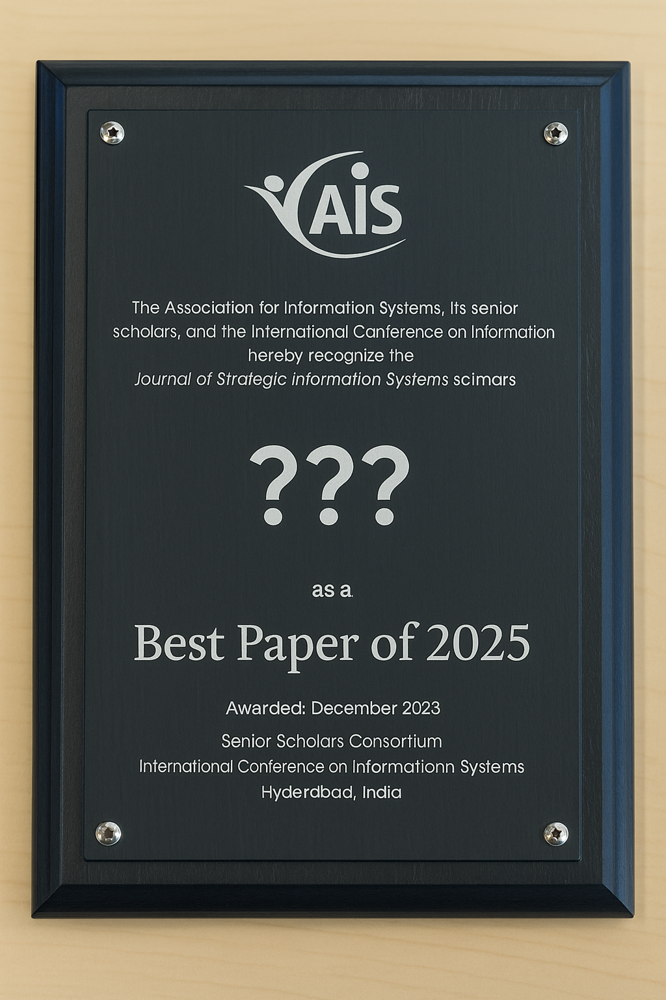

# The Literature Review Seminar

## Qualities

- Distinguish different quality dimensions for literature reviews
- Explain which qualities are essential for the different types of reviews

---

## Exercise: Peer Review of Protocols

In pairs, discuss and refine your **literature review protocol**. Focus on the following elements and their internal coherence: 
**review type → methodological steps → expected contribution**.

📄 *Detailed discussion prompts are provided on the separate handout.*

### 🕒 Structure (2×20 minutes)
- **15 min Discussion**: Start with a brief overview of your protocol, then discuss key elements in depth
- **5 min Reflection**: Take notes on potential changes and refinements

### 💬 Reminder
> Be **critical but constructive**. Ask “why?” and challenge the logic of each choice.
> Aim for clear **internal coherence**, not perfection.

<!--  -->

<!-- 
## Exercise: Best Paper Awards

Form groups based on the **four genres of review papers**:  
**Describing**, **Understanding**, **Explaining**, and **Testing**.

Each group will review exemplar papers—either those you identified or the ones suggested below:

- **Describing**:  [Chan & Reich](https://link.springer.com/article/10.1057/palgrave.jit.2000109) or [Aloini et al.](https://www.sciencedirect.com/science/article/pii/S0378720607000547)
- **Understanding**: [Agarwal et al.](https://pubsonline.informs.org/doi/10.1287/isre.1100.0327) or [Avgerou](https://link.springer.com/article/10.1057/palgrave.jit.2000136)
- **Explaining**: [Krogh et al.](https://www.jstor.org/stable/41703471) or [Leidner & Tona](https://aisel.aisnet.org/misq/vol45/iss1/13/)
- **Testing**: [Sabherwal & Jeyaraj](https://www.jstor.org/stable/26628653) or [Lacity et al.](https://journals.sagepub.com/doi/10.1057/jit.2011.25)

Criteria:

1. Your own assessment of the contribution
2. Elements covered in the course, such as the [storyline](../output/01-goals.html#review-protocols-structure-and-contents-i), [internal coherence](../output/01-goals.html#central-aspect-internal-coherence), or [methodological rigor](../output/02-steps.html)

---

## Exercise: Best Paper Awards

The [worksheet](../exercises/exemplars/exemplars.pdf) consists of two parts:

1. A summary sheet for the characteristics of exemplary reviews
2. A note sheet for your own literature review protocol or paper

 **Question:**  *What is the exemplar paper your group selected? Why do you consider it an outstanding contribution?*

 **Task:**  *Use the second part of the worksheet to take notes: How might you develop your own review protocol or paper based on what you've learned?*

⏱️ **Timing**: 30 minutes → Read, highlight, discuss, and take notes.

🗣️ Select one group member to summarize the key strengths of your chosen paper.

 -->
<!-- 

## Warm-up exercise

 **Task** (10 min): Record your topic, research question, and the type of review.

---

## Warm-up exercise

 **Question**: If aiming for a top-tier journal, what key aspects would you focus on to produce a high-quality review paper?

---

## Studying the qualities of exemplars

Studying exemplary literature reviews and analyzing the qualities that make them compelling provides valuable insights into what constitutes a high-quality review.

 Form  a review panel to evaluate the review papers. Provide recommendations on which papers to accept and which to reject, along with justifications for each decision.
-->

---

## What makes a review successful?

 

 

 **Question**: Which factors lead to a high citation impact?

---

## An empirical analysis

The study of Wagner et al. (2021)

- There is a plethora of commentaries, opinions, suggestions, and ideas on the characteristics of a high quality review 
- We brought together an international and interdisciplinary team to study the question empirically
- The research question: What are the main attributes that affect the scientific impact of IS review papers?
- The research model covers factors at three levels: the paper, the authors, and the journal

---

## Findings

---

## Key insights

- Methodological **transparency** is associated with higher scientific impact across all types of reviews
- The development of a **research agenda** is associated with higher scientific impact (except for reviews aimed at theory testing, due to a lack of data)
- The effects vary between **review types**, providing empirical evidence to the notion of methodological and typological pluralism
- Differences in **theoretical contributions** are hard to measure (contributing to *explaining*, in itself, does not lead to a higher impact)

---

## Methodological transparency and systematicity

Paré et al. (2016) sensitize us to the distinction between **systematicity** and **transparency**:
One refers to the *soundness of execution* and the other refers to the *explicitness of reporting*.

<!-- Pare2016/Templier2018 -->

---

## Reporting standards

- In Information Systems, Templier and Paré (2018) provide an overview of recommended reporting items
- In the health sciences, the [PRISMA checklist](https://www.prisma-statement.org/prisma-2020-checklist) provides established guidelines for transparent reporting of literature reviews

---

## Theoretical contributions

- Quality of theoretical contributions is hard to measure
- There are high-level guidelines such as Leidner and Tona's (2021) *thought-gear model for theorizing*

---

## Research agenda

- Schryen et al. (2020) state that a research agenda "refers to elaborating on how researchers should conduct future research to achieve meaningful progress and possibly suggesting specific research designs, empirical settings, or offering strategic recommendations"
- There are almost no recommendations on how to develop a research agenda
- It may be helpful to study exemplars, which may inspire your research agenda

---

## Summary

Literature reviews can be expected to be more impactful if they

- are positioned with regard to an **appropriate review type**
- are **more transparent** in explicating their methods
- make a compelling and innovative **theoretical or empirical contribution**
- provide more comprehensive **suggestions for future research**

---

## References

Leidner, D. E., & Tona, O. (2021). A thought-gear model of theorizing from literature. *Journal of the Association for Information Systems*, 22(4), 10. doi:[10.17705/1jais.00683](https://aisel.aisnet.org/jais/vol22/iss4/10/)

Paré, G., Tate, M., Johnstone, D., & Kitsiou, S. (2016). Contextualizing the twin concepts of systematicity and transparency in information systems literature reviews. *European Journal of Information Systems*, 25, 493-508. doi:[10.1057/s41303-016-0020-3](https://link.springer.com/article/10.1057/s41303-016-0020-3)

Schryen, G., Wagner, G., Benlian, A., and Paré, G. 2020. “A Knowledge Development Perspective on Literature Reviews: Validation of a New Typology in the IS Field,” *Communications of the Association for Information Systems*, 46 (Paper 7), 134–186. doi:[10.17705/1CAIS.04607](https://aisel.aisnet.org/cais/vol46/iss1/7/)

Wagner, G., Prester, J., Roche, M. P., Schryen, G., Benlian, A., Paré, G., and Templier, M. 2021 “Which Factors Affect the Scientific Impact of Review Papers in IS Research? A Scientometric Study”. *Information & Management*, 58(3), 103427. doi:[10.1016/j.im.2021.103427](https://www.sciencedirect.com/science/article/abs/pii/S037872062100001X)
