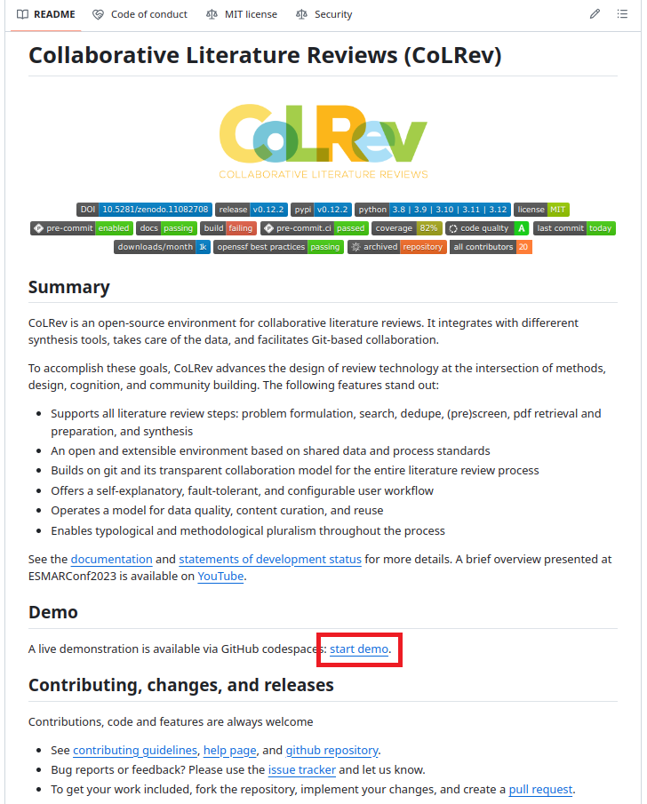
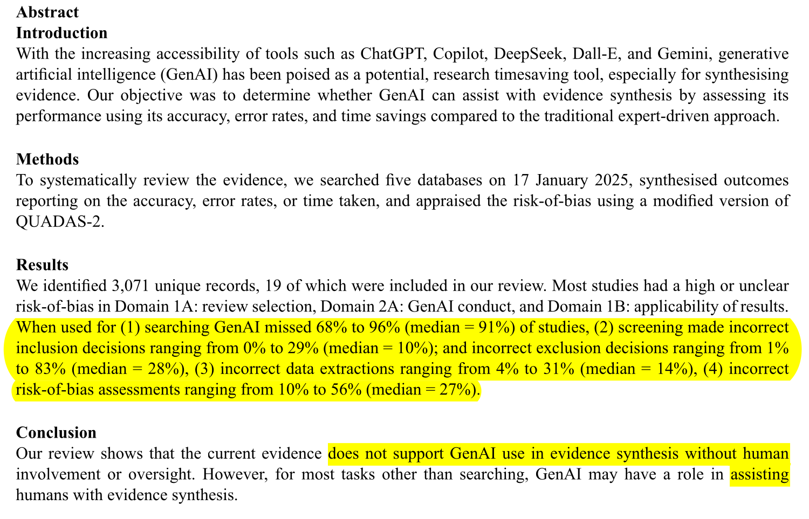

# The Literature Review Seminar

## Tools

- Distinguish the major approaches of setting up tools for literature reviews
- Practice the use of an open-synthesis platform (CoLRev)
- Appreciate how AI and genAI/LLM may change the conduct of literature reviews

---

## Start the demo

 Start the [demo](https://github.com//codespaces/new?hide_repo_select=true&ref=main&repo=767717822) (account and login on GitHub required)

---

# Typical setups <a id="setups"></a>

Overall, there are many tools for literature reviews. The [systematicreviewtoolbox.com](http://systematicreviewtools.com/) alone listed over 250 tools.

There are three major approaches:

- **Self-managed approach**: Combine multiple tools, including a reference manager, and Excel
- **Platform**: Select a platform that handles the whole workflow and use the default functionality or extensions

---

# Self-managed approach <a id="self-managed"></a>

Common elements:

- **Reference manager** to import, deduplicate, screen, extract data, analyze, and cite search results (e.g., Zotero, Endnote, Citavi, Mendeley, Jabref)
- **Excel** can be used for the screen, data extraction, and analysis
- **Specialized tools** for individual steps (see next slide)
- **Word processor** for write-up

---

# Self-managed approach: Tools <a id="self-managed-tools"></a>

Leading automation tools for literature reviews (Wagner et al. 2021):

| Step                      | Research Tools                                                                                                                                        |
|---------------------------|-------------------------------------------------------------------------------------------------------------------------------------------------------|
| **Search**                | [*LitSonar*](https://litsonar.com/): Supports search query translation.                                                                               |
|                           | [*litsearchr*](https://elizagrames.github.io/litsearchr/): Supports search strategy development.                                                      |
|                           | [*connectedpapers*](https://www.connectedpapers.com/), [inciteful](https://inciteful.xyz/): Support citation searches.                                |
|                           | [*TheoryOn*](https://theoryon.org/): Supports construct searches.                                                                                     |
| **Screen**                | [*ASReview*](https://asreview.nl/): AI-supported screening (see [intro](https://www.youtube.com/watch?v=k-a2SCq-LtA)).                                |
| **Quality Assessment**    | [*Robot Reviewer*](https://www.robotreviewer.net/): AI-supported quality appraisa (see [intro](https://www.youtube.com/watch?v=0xwwze83sBs)).         |
| **Data Analysis**         | [*Obsidian*](https://obsidian.md/): A tool for knowledge management and data extraction.                                                              |
|                           | [*RevMan*](https://training.cochrane.org/online-learning/core-software/revman): A tool to conduct meta-analyses.                                      |

---

# Self-managed approach <a id="self-managed-assessment"></a>

Advantages:

- Low cost and quick setup
- Relatively high flexibility to use different tools and pursue different goals (review types)

Disadvantages:

- Data is handled manually: assigning IDs, sharing PDFs, keeping track of the status of records, data conversion, manual import and export
- Error-prone, especially when using Excel (see [1](https://www.washingtonpost.com/news/wonk/wp/2016/08/26/an-alarming-number-of-scientific-papers-contain-excel-errors/), [2](https://www.wired.co.uk/article/spreadsheet-excel-errors))
- Individual tools may have limited compatibility
- Working in a team requires explicit and careful coordination
- Updating searches is challenging

<!-- 
https://www.zdnet.com/article/what-is-ransomware-everything-you-need-to-know-and-how-to-reduce-your-risk/
-->
---

# Platforms

<!-- 
| Tool                                     | Open Source | Extensibility  | Review types         | Deployment    | 
|------------------------------------------|-------------|----------------|----------------------|---------------|
| [Covidence](https://www.covidence.org/)  | no  (paid)  | upon request   | systematic reviews   | web only      |
| [HubMeta](https://hubmeta.com/)          | no  (free)  | upon request   | systematic reviews   | web only      |
| [BUHOS](https://www.buhos.org/)          | yes         | no             | systematic reviews   | web and local |
 -->

<style>
table {
  width: 100%;
}
th {
  position: sticky;
  top: 0;
  background: white;
}
</style>

| **Criteria**                                  | **CoLRev**                        | [**LitStudy**](https://github.com/NLeSC/litstudy)  | [**BUHOS**](https://github.com/clbustos/buhos)  | [**Covidence**](https://www.covidence.org/)   |
|-----------------------------------------------|-----------------------------------|----------------------------------|---------------------------------|---------------------------------|
| **Review types**                              |                                   |                                  |                                 |                                 |
| Supports different genres of review methods   | ![yes]                            | ![no]                            | ![no]                           | ![no]                           |
| **Process steps**                             |                                   |                                  |                                 |                                 |
| Review objectives and protocol                | ![yes]                            | ![yes]                           | ![yes]                          | ![yes]                          |
| Search                                        | ![yes]                            | ![yes]                           | ![yes]                          | ![yes]                          |
| Duplicate handling                            | ![yes]                            | ![no]                            | ![maybe]                        | ![maybe]                        |
| (Pre)Screen                                   | ![yes]                            | ![maybe]                         | ![yes]                          | ![yes]                          |
| Data extraction                               | ![yes]                            | ![maybe]                         | ![yes]                          | ![yes]                          |
| Data analysis and quality appraisal           | ![yes]                            | ![maybe]                         | ![yes]                          | ![yes]                          |
| Synthesis and reporting                       | ![yes]                            | ![yes]                           | ![yes]                          | ![yes]                          |
| **Process qualities**                         |                                   |                                  |                                 |                                 |
| Extensibility                                 | ![yes]                            | ![yes]                           | ![no]                           | ![no]                           |
| Extensions                                    | 102                               | 0                                | 0                               | 0                               |
| Search updates                                | ![yes]                            | ![no]                            | ![maybe]                        | ![maybe]                        |
| Search: APIs                                  | ![yes]                            | ![yes]                           | ![yes]                          | ![no]                           |
| **Collaboration**                             |                                   |                                  |                                 |                                 |
| Large teams                                   | ![yes]                            | ![maybe]                         | ![maybe]                        | ![maybe]                        |
| Algorithms                                    | ![yes]                            | ![yes]                           | ![maybe]                        | ![maybe]                        |
| **Data management**                           |                                   |                                  |                                 |                                 |
| Transparency                                  | ![yes]                            | ![no]                            | ![no]                           | ![no]                           |
| Validation                                    | ![yes]                            | ![no]                            | ![no]                           | ![no]                           |
| **Platform**                                  |                                   |                                  |                                 |                                 |
| OSI-approved license                          | ![yes]                            | ![yes]                           | ![yes]                          | ![no]                           |
| Peer-reviewed                                 | ![no]                             | ![yes]                           | ![yes]                          | ![no]                           |
| Technology                                    | Python                            | Python                           | Ruby                            | Proprietary                     |
| Setup                                         | Local or cloud                    | Local or cloud                   | Server                          | Server                          |
| Interface                                     | CLI, Programmatic                 | Jupyter Notebook                 | Web-UI                          | Web-UI                          |
| Contributors                    |  |  |  | NA                                                                     |
| Commits                         |  |  |  | NA                                                                     |
| Last release                    |   |   |   | NA                                                                     |
| Current release              |  |  | | NA |

[yes]: ../assets/yes.svg
[no]: ../assets/no.svg
[maybe]: ../assets/maybe.svg


<!-- 
---
Note: advantages/disadvantages hard to say (depend on the tool)

# Platforms

Advantages:

- Data is managed end-to-end
- Collaboration and coordination of teams is supported
- Graphical user interfaces are provided for each step
- Documentation and support tends to be comprehensive

Disadvantages:

- Often restricted to a specific type of review, i.e., systematic reviews, which are not the most common types in Information Systems
- Limited flexibility to use other tools and limited extensibility (lock-in)
- Costly or restricted in functionality/quality of service
-->

---

<style>
blockquote {
    border-top: 0.1em;
    font-size: 60%;
    margin-top: auto;
}
</style>

# Platforms: CoLRev and open synthesis <a id="colrev"></a>

We may envision an open and extensible research platform supporting different types of literature reviews.

The following aspects deem relevant:

- Shared data structures and processes
- Open-Source license and extensibility through packages
- Transparent data management, enabling the collaboration of reviewers and algorithms, including Artificial Intelligence and Generative Artificial Intelligence
- Self-explanatory workflow
<!-- 
| Tool                                                   | Open Source | Extensibility  | Review types      | Deployment       | 
|--------------------------------------------------------|-------------|----------------|-------------------|------------------|
| [CoLRev](https://colrev-environment.github.io/colrev/) | yes         | yes            | All review types  | Local or cloud   |
 -->


> Disclaimer: I am the lead developer of CoLRev.

---

# Platforms: CoLRev and open synthesis

- An open platform supporting all steps (see table below and [demo](https://colrev-environment.github.io/colrev/) in the documentation)
- Based on Git for data versioning and collaboration
- Extensible, offering different packages, e.g., packages for different types of reviews (not just "systematic reviews")

| Step                          | Operations                                                                     |
|-------------------------------|--------------------------------------------------------------------------------|
| Problem formulation           | ``colrev init``                                                                |
| Metadata retrieval            | ``colrev search``, ``colrev load``, ``colrev prep``, ``colrev dedupe``         |
| Metadata prescreen            | ``colrev prescreen``                                                           |
| PDF retrieval                 | ``colrev pdfs``                                                                |
| PDF screen                    | ``colrev screen``                                                              |
| Data extraction and synthesis | ``colrev data``                                                                |

---

# Platforms: CoLRev and open synthesis

 Start the [demo](https://github.com//codespaces/new?hide_repo_select=true&ref=main&repo=767717822) (account and login on GitHub required)

<!-- 
Note: the tutorial was extracted to a separate page (see link: https://colrev-environment.github.io/colrev-tutorial-notebooks/)
-->

 Form small groups of 2-3 people

 Open the [tutorial](https://colrev-environment.github.io/colrev-tutorial-notebooks/) worksheet and complete it

 Consult the [documentation](https://colrev-environment.github.io/colrev/) whenever necessary



---

# AI, genAI and the future(s) of literature reviews

<br>

 **Question**: How would you use genAI-tools in a literature review?


---

# LLMs, current challenges, and promises

Status quo: "Directly asking ChatGPT for research summaries does not produce compelling results"

- Language vs. knowledge and the problem of hallucination (fictitious references) 
- Retrieval-augmented generation (APIs) as a potential remedy (e.g., [Consensus](https://consensus.app/))
- LLMs do not necessarily have access to paywalled research

Researchers need to understand nuances of review types, methods, and steps

---

# Clark et al. (2025): Generative artificial intelligence use in evidence synthesis: A systematic review



---

# Which developments can be anticipated?

Review types

- Descriptive reviews may be the first to become obsolete given the summarizing capabilities of LLM
- For testing reviews, LLM can support different steps, including the generation of code for the analysis
- For reviews aimed at understanding or explaining, there may be different futures

Steps of the process

- LLM capabilities, or corresponding tools like [litmaps](https://www.litmaps.com/), are particularly helpful for exploratory activities
- Language handling capabilities are useful for the design of queries in the systematic search phase (need to group synonyms)
- In the screen, restrictions of human cognitive capacities are one of the prime reasons to screen most of the papers based on the metadata (instead of the full-text). This could change with LLM, which can process full-text documents efficiently (possibly as part of the prescreen).
- Applications of LLM in the later steps have yet to be explored

---

# Prompt example: Search query formulation

Best prompt identified by Wang et al. (2023):

```
You are an information specialist who develops Boolean queries for systematic reviews. You have extensive experience
developing highly effective queries for searching the information systems literature. Your specialty is developing
queries that retrieve as few irrelevant documents as possible and retrieve all relevant documents for your information
needs. You are able to take an information need such as: “Review of IT Business Value” and generate valid Web of
Science queries such as:
“TI=(IT OR IS OR …) AND TI=(value OR payoff OR …) AND TI=(firm OR business OR …)”.

Now you have your information needed to conduct research on “The effect of LLM on individual performance at work”,
please generate a highly effective systematic review Boolean query for the information need.
```

⚠️ ChatGPT is useful for writing Boolean search queries in **high-precision reviews**, such as rapid reviews

---

# Prompt example: Screen

Best prompt identified by Syriani et al. (2023):

```
Context: I am screening papers for a systematic literature review. The topic of the systematic review is the effect of
generative AI on individual productivity for programmers. The study should focus exclusively on this topic.
Instruction: Decide if the article should be included or excluded from the systematic review. I give the title and
abstract of the article as input. Only answer include or exclude. Be lenient. I prefer including papers by mistake
rather than excluding them by mistake.

Task i:
•	Title: “Twelve tips to leverage AI for efficient and effective medical question generation”
•	Abstract: “Crafting quality assessment questions in medical education […]”
```

⚠️ Performance of LLM-based screening varies considerably across datasets, indicating **limited generalizability**
⚠️ The findings show that LLMs does not consistently perform better than random classification (in terms of recall)

---

# Summary

- Carefully assemble your toolkit by considering the

    - Fit with the type of review 
    - Need for collaboration in a team
    - Compatibility between tools (effort for data management and conversion)

- Consider open-synthesis platforms such as CoLRev
- Understand how AI and genAI/LLM may facilitate or change the process 

---

# The next steps...

- Continue to develop the review protocol
- Schedule a [meeting](https://calendly.com/gerit-wagner/30min) to discuss the protocol as needed

---

# Thank you!

- Thank you for participating in the seminar
- Keep in mind: If you work on literature reviews, there are opportunities to reconnect!
- Give us some [feedback](https://digital-work-lab.github.io/literature-review-seminar/docs/evaluations.html)
- Help us spread the word to other students


---

<style scoped>
p {
    padding-left: 36px;
    text-indent: -36px;
}
</style>

## References

Clark, J., Barton, B., Albarqouni, L., Byambasuren, O., Jowsey, T., Keogh, J., ... & Jones, M. (2025). Generative artificial intelligence use in evidence synthesis: A systematic review. *Research Synthesis Methods*, 1-19. doi:[10.1017/rsm.2025.16](https://doi.org/10.1017/rsm.2025.16).

Syriani, E., David, I., and Kumar, G. 2023. “Assessing the Ability of ChatGPT to Screen Articles for Systematic Reviews,” arXiv. doi:[10.48550/ARXIV.2307.06464](https://doi.org/10.48550/ARXIV.2307.06464).

Wagner, G., Lukyanenko, R., & Paré, G. (2022). Artificial intelligence and the conduct of literature reviews. *Journal of Information Technology*, 37(2), 209-226. doi:[10.1177/0268396221104820](https://journals.sagepub.com/doi/full/10.1177/02683962211048201)

Wang, S., Scells, H., Koopman, B., and Zuccon, G. 2023. “Can ChatGPT Write a Good Boolean Query for Systematic Review Literature Search?” in *Proceedings of the 46th International ACM SIGIR Conference on Research and Development in Information Retrieval*, pp. 1426–1436. doi:[10.1145/3539618.3591703](https://doi.org/10.1145/3539618.3591703).