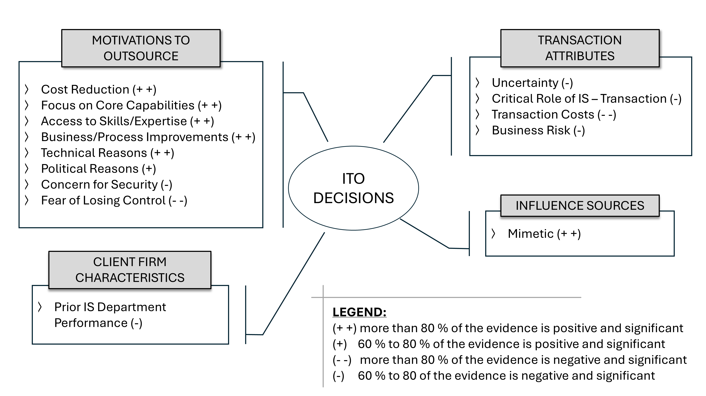
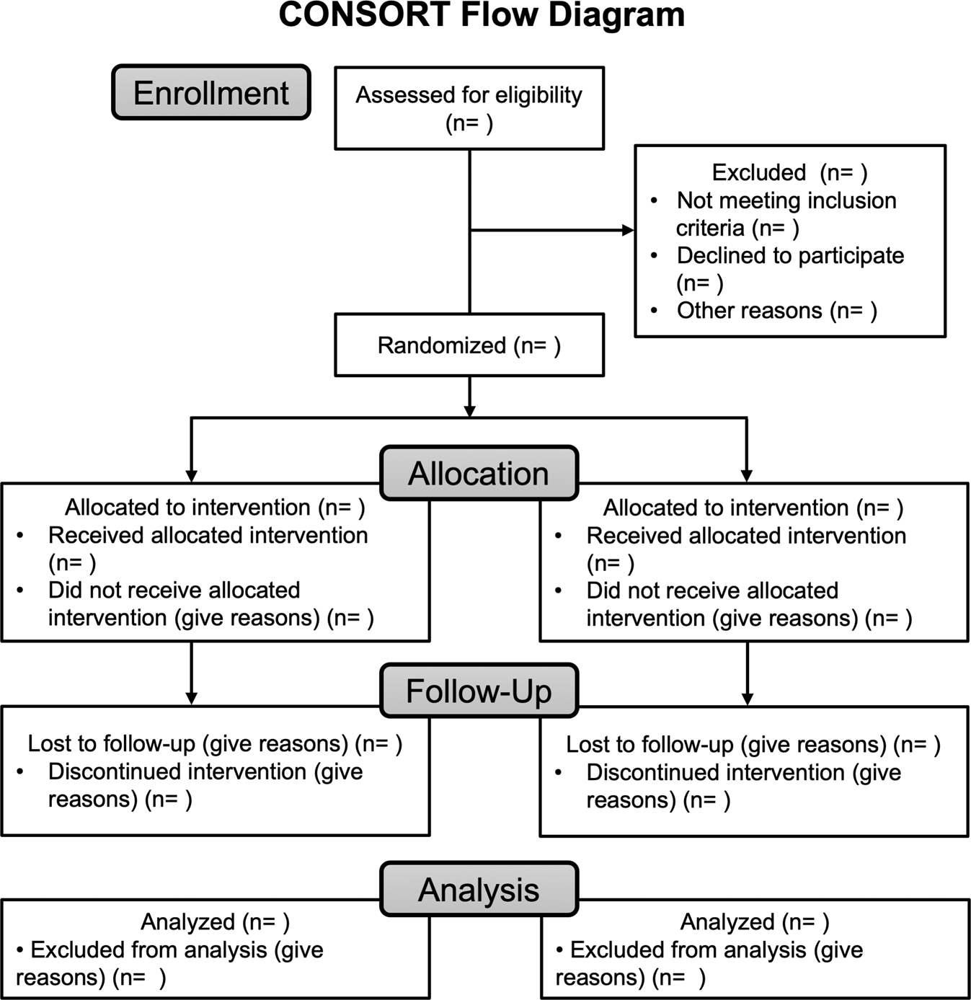
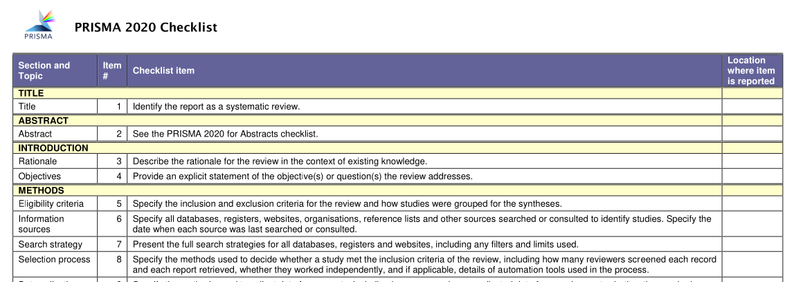

# The Literature Review Seminar

## Steps of the process

- Understand the generic steps of the review process
- Appreciate the critical methodological choices in the search, screen, and analysis

---

## What are the generic steps of a literature review?

    

 

 **Task**: Outline the steps of the literature review process as you envision them.

<!-- 
https://unsplash.com/de/fotos/menschen-die-tagsuber-auf-grunem-rasen-sitzen-7rImz-goqfQ
-->
---

## Generic steps: Examples

    

The hermeneutic framework of Boell and Cecez-Kecmanovic (2014) vs.
The systematic guide of Okoli (2015)

---

## Generic steps: Templier and Paré (2018)

    

---

## Generic steps: Templier and Paré (2018)

    

---

## Generic steps

Summary

- The **nature of steps varies**, including their labels, their characteristics, and how they are arranged
- The steps **depend on the review type**
- Some steps are more **generic**, while others are more **specific** and only apply to selected types of reviews

In the following, we focus on the steps summarized by Templier and Paré (2018):

1. Problem formulation
2. Literature search
3. Screening for inclusion
4. Quality assessment
5. Data extraction
6. Data analysis and interpretation

---

## Problem formulation

- Rationale for the review, including an overview of related review papers
- Gap-spotting or problematization (Alvesson and Sandberg 2011):

    - Gap-spotting is seen as (too) common, and may only signify a contribution if the authors can make a convincing argument that the gap is important
    - Problematization, as an approach that challenges existing theory and the underlying assumptions, can lead to more interesting and noteworthy contributions

- Research question or objectives

---

## Literature search: Foundations

- Search types: *Lookup* vs. *exploratory* vs. **systematic search** (Gusenbauer and Haddaway 2021)
- Search scope: time, journals, and academic vs. gray literature
- Search techniques (with associated search sources):

    - Database search (keyword-based)
    - Backward search, i.e., search reference sections to go back in time (aka. snowballing, pearl-growing)
    - Forward search, i.e., using citation indices to go forward in time
    - Table-of-content search (whole journals)
    - Sampling from prior review papers
    - Consulting with peers (e.g., through direct contact or mailing lists)

---

## Literature search: Citation searches

    

---

## Literature search: The database search

- Most common search strategy in the management disciplines (58% according to Hiebl, 2023)
- Overview of databases: [searchsmart.org](https://www.searchsmart.org/), Knackstedt and Winkelmann (2006), Hiebl (2023)
- Effective search strategies for database searches combine search terms with Boolean operators

---

## Literature search: The "building-blocks" approach

- RQ: What factors do influence physicians’ acceptance of telemedicine?

    

Resulting search string: `(telemedicine OR telehealth OR ...) AND (physician OR doctor OR ...) AND (adoption OR acceptance OR resistance OR ...)`

Building blocks can be based on established frameworks like PICO (population-intervention-control-outcome)

---

## Literature search: Application

- Draft a search strategy for your topic, following the building-blocks approach.

    

- Does the building block approach provide a good fit with your context?

---

## Exercise: Reviewing a search strategy

Imagine you serve as a reviewer for a conference. You review a paper on algorithmic decision-making, along with Table 2.

 **Task**: Evaluate the proposed search strategy critically, taking into account the building-block approach. Make a recommendation to accept, revise, or reject.

> \* Note: Example taken from Mahmud, H., Islam, A. N., Ahmed, S. I., & Smolander, K. (2022). What influences algorithmic decision-making? A systematic literature review on algorithm aversion. *Technological Forecasting and Social Change*, 175, 121390.
>   The [search-query](https://colrev-environment.github.io/search-query/) package supports the validation (linting) of search queries to identify syntactical errors and suggest improvements.

---

## Literature search: Strengths and shortcomings of database searches

Strengths:

- Relatively efficient (see Wagner et al. 2021, Appendix A3)
- Transparent and reproducible

Shortcomings:

- Keyword searches rely on exact matches *
- Need to be familiar with the vocabulary (check keywords or taxonomies like [MeSH](https://meshb.nlm.nih.gov/?_gl=1*1v2wumx*_ga*MTAzMDkzMDY3OC4xNjg1OTY3ODEy*_ga_7147EPK006*MTY5ODMwNDkxNi4xMC4xLjE2OTgzMDQ5MjIuMC4wLjA.*_ga_P1FPTH9PL4*MTY5ODMwNDkxNi4xMC4xLjE2OTgzMDQ5MjIuMC4wLjA.) etc.)
- Assumption of controlled scientific vocabulary although disciplines like Information Systems have abandoned corresponding efforts decades ago (Weber 2003)
- Some literature reviews report the intended coverage (e.g., comprehensive), but none report to which degree it was accomplished (using evidence and metrics)

> \* This is why the health sciences strictly enforce the use of descriptive titles and standard terminology in primary studies.

---

## Literature search: Search metrics

The common objective is to identify all relevant papers. Literature searches retrieve documents:

    

Three key metrics are particularly relevant in the context of literature searches (Cooper et al. 2018):

1. **Sensitivity** aka. recall: $TP / (TP + FN)$. *How many of the relevant papers do we find?* ❓
2. **Specificity**: $TN / (TN + FP)$. *How well does the search exclude irrelevant results?* ❓
3. **Precision**: $TP / (TP + FP)$. *How many of the search results are actually relevant?*

---

## Literature search: Assessing searches

- **Precision** is the only metric that can be measured in a typical literature review
- A **highly precise search strategy should be suspicious** because the search may not be comprehensive enough
- Based on the [SYNERGY](https://github.com/asreview/synergy-dataset) dataset, average precision is 2% - 4% in medicine, chemistry, and computer science

 **Question**: Would you expect more precise searches in disciplines like Information Systems, Management, or the Social Sciences?

---

## Terminating the search

No formal "stopping rule" exists — reviewers look for **completeness, transparency**, and **justifiability**.

Often guided by the **criterion of saturation**:

- Saturation in understanding *(Boell & Cecez-Kecmanovic, 2014)*
- "New articles only introduce familiar arguments, methodologies, findings, authors, and studies" *(Levy and Ellis, 2006)*
- Theoretical saturation *(Wolfswinkel et al., 2013)*

Credibility depends on:
- **Comprehensiveness** of the applied **search techniques**
- Alignment with the topic’s **epistemological context**:

    - **High-paradigm disciplines**: database search may suffice  
    - **Low-paradigm or emergent fields**: require iterative, **citation-based strategies** (e.g., forward/backward search)

> “Saturation is a matter of judgment, not of formula.”  
> — *Boell & Cecez-Kecmanovic (2014)*

---

## Literature search: Outlook

Open challenge: 

- How can we iterate efficiently?
- How do we justify the decision to terminate a search?
- How can we use evidence to search effectively?
- How can we make progress without database providers?

<!-- 
https://unsplash.com/de/fotos/toddlers-standing-in-front-of-beige-concrete-stair-bJhT_8nbUA0
-->

---

## Screen

- The screen is typically completed in two parts:

    - A pre-screen based on metadata (*"include if in doubt"*)
    - A screen based on full-text documents, resulting in the final sample

- The screen is often based on explicit inclusion and exclusion criteria

---

## Screening reliability

Screening tasks are often split among the review team to complete the process **more quickly**, and to ensure **reliable decisions**.

Process:

1. Definition of criteria, training, and pilot test
2. Parallel-independent screen (partially or fully overlapping sample)
3. Independent screen of the remaining papers (if any)
4. Reconciliation: in case of disagreements, final decisions are made by selected team members (often more senior researchers)
5. Calculate inter-rater agreement (e.g., Cohen's Kappa) and report the process

<!-- 
https://en.wikipedia.org/wiki/Cohen%27s_kappa
-->
---

## Interpretation of Kappa Values

 

| Kappa Value Range | Interpretation           |
|-------------------|--------------------------|
| ≤ 0               | No agreement             |
| 0.01 – 0.20       | None to slight           |
| 0.21 – 0.40       | Fair                     |
| 0.41 – 0.60       | Moderate                 |
| 0.61 – 0.80       | Substantial              |
| 0.81 – 1.00       | Almost perfect agreement |

> Note: When data is skewed—meaning one category is much more common than others—the Kappa statistic can be artificially low even if there is a high level of agreement. This occurs because Kappa adjusts for the level of agreement that would be expected purely by chance. In skewed distributions, the expected chance agreement tends to be high, which lowers the Kappa score. Essentially, in skewed distributions, even a relatively high observed agreement may not lead to a high Kappa, as the metric accounts for the imbalance.

---

## Reporting the search and screen

    

The PRISMA flow chart (updated version by Tricco et al. 2018)

An online version is available [here](https://estech.shinyapps.io/prisma_flowdiagram/)

---

## Data analysis

Key differences with regard to data extraction and analysis:

- Focus on metadata vs content 
- Inductive vs deductive reasoning

> Note: The distinction between inductive and deductive modes of reasoning has critical implications. For instance, it would be incoherent to present an inductive analysis with inter-coder reliability assessment, or a deductive analysis without a pre-defined coding schema.

---

## Data analysis example: Metadata profiling (example)

    

---

## Data analysis example: Co-citation analysis

    

> Note: Information Systems journals do not publish many scientometric papers. *MIS Quarterly* had an explicit policy against these types of analyses, but *Information Systems Research* has published [co-citation analyses](https://pubsonline.informs.org/doi/10.1287/isre.1080.0227).

---

## Data analysis example: VOS viewer

    

- Example keyword analysis: https://www.youtube.com/watch?v=9dTWkNRxUtw
- Example bibliometric analysis: https://www.youtube.com/watch?v=xmLWjcsV4zQ

---

## Data analysis example: Inductive coding

Grounded theory is an inductive method commonly used in literature reviews (Wolfswinkel et al. 2013)

In the data analysis phase, the three coding techniques are central:

- **Open coding** generates higher-abstraction level type categories from sets of concepts/variables
- **Axial coding** develops categories and relates them to their possible sub-categories
- **Selective coding** integrates and refines the categories

---

## Data analysis: The Gioia data structure

The coding process and results are often illustrated in the *Gioia data structure*

    

---

## Data analysis: Example for inductive analysis

Context:

- Scope: Digital platforms for knowledge-intensive services, such as Upwork, Fiverr, or TopCoder
- Sample: 50 papers, mostly published in the Information Systems discipline
- Data: Text fragments and figures have been pre-selected (see [worksheet](../exercises/inductive_coding/day_1_steps_data_Inductive-coding-Worksheet.pdf))

 **Task**: Analyze extant research and inductively develop a process model

<!-- TODO : present a clear Gioia structure as a result -->

---

## Data analysis example: Aggregating evidence (I)

**Vote counting** is one technique to aggregate the evidence from prior empirical studies

- Key variables are extracted and compiled in a list of master codes
- Effects between independent and dependent variables are coded:

    - *+1* for a positive significant effect
    - *0* for no-significant effects
    - *-1* for negative significant effects

---

## Example: Lacity et al. (2011)

Effects are aggregated and presented as follows:

    

---

## Data analysis example: Aggregating evidence (II)

Strength of vote counting:

- Aggregates evidence from **quantitative and qualitative studies**

Shortcoming of vote counting:

- Risk of bias is not assessed
- Effect sizes are not determined

Meta-analysis techniques address these shortcomings.

---

## Quality appraisal / Risk of bias assessment (I)

- Example: Ringeval et al. (2020): "Fitbit-Based Interventions for Healthy Lifestyle Outcomes: Systematic Review and Meta-Analysis"
- The [Cochrane risk-of-bias tool for randomized trials (RoB 2)](https://training.cochrane.org/handbook/current/chapter-08) covers seven **domains of bias**, as illustrated in the table

> Note: For non-experimental studies, other domains of bias may apply (such as the use of fixed-effects for years as a control for omitted time-varying confounders/endogeneity).
> 
> Note: It is good practice to analyze whether results differ between high and low quality studies (e.g., through subgroup analyses) instead of excluding low-quality studies.

---

## Quality appraisal / Risk of bias assessment (II)

    

---

## Data analysis: Data extraction

Research objective: "to assess the effects of Fitbit-based interventions, compared with non-wearable control groups, on healthy lifestyle outcomes." (Ringeval et al. 2020)

Type of primary studies: Randomized clinical trials (RCTs), as illustrated in the CONSORT flow diagram

Outcome of interest (at follow-up):

- **Steps per day** (our focus)
- Moderate-to-vigorous physical activity (MVPA)
- Weight loss
- Sedentary behavior (self-reported)

---

## Data analysis

 **Task**: Extract the data from two randomized controlled trials: [Thorndike et al. 2014](https://pubmed.ncbi.nlm.nih.gov/24950218/), [van Blarigan et al. 2019](https://pubmed.ncbi.nlm.nih.gov/30866859/) based on the following coding sheet:

    

---

## Data analysis: Forest plot of standardized mean differences

    

---

## Data analysis: Meta-analysis

We extract or calculate **Standardized Mean Differences (SMD)**:

$$
d = \frac{\bar{X}_\text{intervention} - \bar{X}_\text{control}}{SD_\text{pooled}}
$$

**Pooled standard deviation:**

$$
SD_\text{pooled} = \sqrt{ \frac{(n_1 - 1)SD_1^2 + (n_2 - 1)SD_2^2}{n_1 + n_2 - 2} }
$$

<!-- 

**Small-sample correction (Hedges’ *g*):**

$$
g = d \times \left(1 - \frac{3}{4(n_1 + n_2) - 9} \right)
$$

Use **Hedges' g** when sample sizes are small.  
Also calculate **SE** to determine study weights.
-->

> SMD is also known as *Cohen's d*. For small sample sizes, the corrections of *Hedge's g* should be used.
> Note: For research models, we will typically rely on correlations as effect sizes (beta coefficients depend on the other variables of the model).

---

# Random Effects Meta-Analysis

We assume the true effect size varies between studies:

**Weighted average of effects:**

$$
\hat{\mu} = \frac{ \sum_{i=1}^{k} w_i \cdot d_i }{ \sum_{i=1}^{k} w_i }
$$

**Weights (account for variance):**

$$
w_i = \frac{1}{SE_{d_i}^2 + \tau^2}
$$

- $\tau^2$: between-study variance
- $SE_{g_i}$: standard error of each SMD

> Interpretation: Larger $w_i$ = more influence on pooled estimate. Output: Overall effect size with 95% CI shown in forest plot.
> The [Doing Meta-Analysis in R](https://bookdown.org/MathiasHarrer/Doing_Meta_Analysis_in_R/) book by Harrer et al. offers a good overview of meta-analysis methods.

---

## Discussion of the data analysis section

 **Task**: Create a quick draft for the data extraction and analysis section. 

- Would you follow an inductive or deductive approach (why)?
- What outcomes would you expect ideally?

---

## Possible next steps

 **Task**: Select an exemplary review and fill out the [PRISMA checklist](https://www.prisma-statement.org/prisma-2020) to assess the transparency of reporting.

    

---

## Summary

- Literature reviews vary in **steps and structure** — tailored to review type and disciplinary context  
- We covered the following six steps (in line with Templier & Paré, 2018):

  1. **Problem formulation** – define contribution via gap-spotting or problematization  
  2. **Literature search** – combine database and citation strategies; justify stopping with saturation  
  3. **Screening** – apply transparent inclusion/exclusion criteria; ensure reliability  
  4. **Quality assessment** – assess risk of bias; consider study quality in the interpretation  
  5. **Data extraction** – adopt inductive or deductive approaches in line with the review type
  6. **Data analysis** – choose between techniques like thematic analysis, vote counting, or meta-analysis

**Transparency, methodological rigor, and fit with the topic’s epistemology are key to credibility.**

---

## References

**Generic steps**

Okoli, C. (2015). A guide to conducting a standalone systematic literature review. *Communications of the Association for Information Systems*, 37. doi:[10.17705/1CAIS.03743](https://aisel.aisnet.org/cais/vol37/iss1/43/)

Boell, S. K., & Cecez-Kecmanovic, D. (2014). A hermeneutic approach for conducting literature reviews and literature searches. *Communications of the Association for information Systems*, 34, 12. doi:[10.17705/1CAIS.03412](https://aisel.aisnet.org/cais/vol34/iss1/12/)

Templier, M., & Pare, G. (2018). Transparency in literature reviews: an assessment of reporting practices across review types and genres in top IS journals. *European Journal of Information Systems*, 27(5), 503-550. doi:[10.1080/0960085X.2017.1398880](https://www.tandfonline.com/doi/full/10.1080/0960085X.2017.1398880)

---

**Problem formulation**

Alvesson, M., & Sandberg, J. (2011). Generating research questions through problematization. *Academy of Management Review*, 36(2), 247-271. doi:[10.5465/amr.2009.0188](https://journals.aom.org/doi/abs/10.5465/amr.2009.0188)

**Search**

Gusenbauer, M., & Haddaway, N. R. (2021). What every researcher should know about searching–clarified concepts, search advice, and an agenda to improve finding in academia. *Research Synthesis Methods*, 12(2), 136-147. doi:[10.1002/jrsm.1457](https://onlinelibrary.wiley.com/doi/full/10.1002/jrsm.1457)

Hiebl, M. R. (2023). Sample selection in systematic literature reviews of management research. *Organizational Research MNethods*, 26(2), 229-261. doi:[10.1177/109442812098685](https://journals.sagepub.com/doi/full/10.1177/1094428120986851)

Knackstedt, R., & Winkelmann, A. (2006). Online-Literaturdatenbanken im Bereich der Wirtschaftsinformatik: Bereitstellung wissenschaftlicher Literatur und Analyse von Interaktionen der Wissensteilung. *Wirtschaftsinformatik*, 1(48), 47-59. doi:[10.1007/s11576-006-0006-1](https://link.springer.com/article/10.1007/s11576-006-0006-1)

---

Wagner, G., Prester, J., & Paré, G. (2021). Exploring the boundaries and processes of digital platforms for knowledge work: A review of information systems research. *The Journal of Strategic Information Systems*, 30(4), 101694. doi:[10.1016/j.jsis.2021.101694](https://www.sciencedirect.com/science/article/pii/S096386872100041X)

**Screen**

Tricco, A. C., Lillie, E., Zarin, W., O'Brien, K. K., Colquhoun, H., Levac, D., ... & Straus, S. E. (2018). PRISMA extension for scoping reviews (PRISMA-ScR): checklist and explanation. 
*Annals of Internal Medicine*, 169(7), 467-473. doi:[10.7326/M18-0850](https://www.acpjournals.org/doi/full/10.7326/M18-0850)

---

**Data analysis**

Wolfswinkel, J. F., Furtmueller, E., & Wilderom, C. P. (2013). Using grounded theory as a method for rigorously reviewing literature. *European Journal of Information Systems*, 22(1), 45-55. doi:[10.1057/ejis.2011.51](https://www.tandfonline.com/doi/full/10.1057/ejis.2011.51)

Higgins J, Savovic J, Page MJ, Elbers RG, Sterne JA. Chapter 8: Assessing risk of bias in a randomized trial. In: *Cochrane Handbook for Systematic Reviews of Interventions*. London: Cochrane; 2019. [link](https://training.cochrane.org/handbook/current/chapter-08)

Lacity, M. C., Solomon, S., Yan, A., & Willcocks, L. P. (2011). Business process outsourcing studies: a critical review and research directions. *Journal of Information Technology*, 26, 221-258. doi:[10.1057/jit.2011.25](https://link.springer.com/article/10.1057/jit.2011.25)

Ringeval, M., Wagner, G., Denford, J., Paré, G., & Kitsiou, S. (2020). Fitbit-based interventions for healthy lifestyle outcomes: systematic review and meta-analysis. *Journal of Medical Internet Research*, 22(10), e23954. doi:[10.2196/23954](https://www.jmir.org/2020/10/e23954/)
